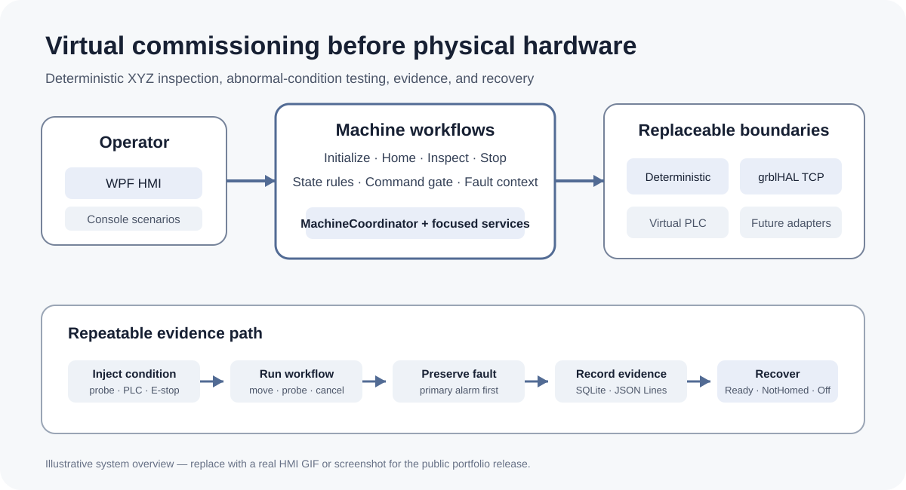
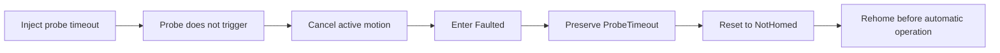
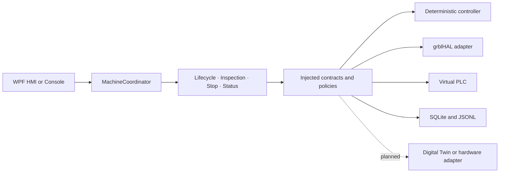

# Virtual Multi-Axis Motion Control Platform

<!-- DOC-NAV:START -->

[Home](README.md) · [Documentation](docs/README.md) · [Getting Started](docs/GETTING_STARTED.md) · [Architecture](docs/ARCHITECTURE.md) · [Testing](docs/TEST_STRATEGY.md) · [Implementation](docs/IMPLEMENTATION_GUIDE.md)

<!-- DOC-NAV:END -->

[](https://github.com/parthoece/multiaxis-motion-sim/actions/workflows/ci.yml)
[](https://github.com/parthoece/multiaxis-motion-sim/actions/workflows/windows-hmi.yml)
[](https://github.com/parthoece/multiaxis-motion-sim/actions/workflows/codeql.yml)
[](global.json)
[](LICENSE)
[](#scope-and-safety-boundary)

> **Test industrial machine-control software before the physical machine exists.**

A software-in-the-loop virtual commissioning platform for deterministic XYZ motion, machine-state control, inspection workflows, fault injection, operator cancellation, recovery, persistence, and HMI testing.

Built with **C#/.NET, WPF, SQLite, xUnit, and grblHAL Simulator**. Digital Twin and physical-controller integrations are planned adapter extensions.

<p align="center">
  
</p>

<!-- Replace the overview above with docs/assets/hmi-demo.gif after capturing a real runtime demonstration. -->

> **Publication evidence:** the repository contains executable console scenarios, automated test sources, persistence and diagnostic paths, and a grblHAL TCP smoke-test workflow. A real HMI GIF or screenshot should replace the overview above before the portfolio release.

## At a glance

| Area | Current status |
| --- | --- |
| Core workflows and recovery | Implemented |
| Deterministic XYZ simulation | Implemented |
| WPF operator HMI | Implemented baseline; additional screens and recorded verification remain |
| grblHAL TCP backend | Implemented baseline; upstream simulator is built separately |
| SQLite and JSON Lines evidence | Runtime persistence implemented; migrations, history queries, and export remain |
| Digital Twin and physical controller | Planned through the existing adapter seam |
| Physical performance and safety | Not validated by this project |

The project demonstrates software architecture and machine-control behavior. It does not claim physical positioning accuracy, real sensor performance, or machinery-safety certification.

## Why this project exists

Machine-control software is often tested only after the mechanical system, electrical controls, controller, sensors, and operator station have been assembled. At that stage:

- software defects are difficult to separate from wiring, sensor, controller, and mechanical problems;
- machine access is limited and shared across engineering teams;
- abnormal conditions may be unsafe or disruptive to reproduce;
- every correction can require another commissioning session.

This project moves a significant part of that validation earlier by providing a deterministic virtual machine and replaceable motion backends.

## What it demonstrates

- **Equipment architecture:** presentation, workflows, domain rules, adapters, persistence, and diagnostics remain separated.
- **Machine-state control:** explicit initialization, homing, automatic operation, fault, reset, and recovery behavior.
- **Reliable asynchronous control:** command exclusion, active-operation cancellation, Stop handling, and completion confirmation.
- **Fault handling:** repeatable probe, PLC, E-stop, permissive, cancellation, and limit-related scenarios with primary-fault preservation.
- **Operator experience:** state-aware WPF commands, live XYZ position, alarms, warnings, measurements, and cycle indicators.
- **Operational evidence:** SQLite history and append-friendly JSON Lines diagnostics.
- **Extensibility:** replaceable controller, PLC, storage, logging, timing, and validation dependencies.

The objective is not merely to animate three axes. It is to verify that the complete equipment workflow remains **controlled, diagnosable, replaceable, and recoverable** during normal and abnormal operation.

## Quick start

### Requirements

- .NET SDK `10.0.302`, or a compatible SDK selected through `global.json`
- Git
- Windows 10 or 11 for the WPF HMI
- Python 3.10 or later for optional repository checks
- A separately built grblHAL Simulator executable for the grblHAL backend

### Run the deterministic scenario

```bash
git clone https://github.com/parthoece/multiaxis-motion-sim.git
cd multiaxis-motion-sim

dotnet restore
dotnet run --project src/MotionControl.OperatorConsole -- normal
```

Expected machine-state sequence:

```text
OFF
→ INITIALIZING
→ NOT_HOMED
→ HOMING
→ READY
→ AUTOMATIC
→ READY
```

The scenario verifies startup permissives, Z-X-Y homing, a five-point inspection recipe, virtual probing, tolerance evaluation, and cycle persistence. Runtime data is written under `.runtime/`.

## Deterministic scenarios

Repeating a scenario should produce the same state transitions, primary alarm, recovery target, and diagnostic evidence.

| Scenario | Command | Expected result |
| --- | --- | --- |
| Successful inspection | `normal` | Five measurements and a completed cycle |
| Operator Stop | `operator-stop` | Active workflow cancellation and deliberate recovery |
| Probe timeout | `probe-timeout` | Primary alarm preserved; rehoming required |
| Missing part | `part-missing` | Cycle rejected because a process permissive is unavailable |
| E-stop activation | `estop` | Faulted state and invalidated homing |
| PLC communication loss | `plc-loss` | Communication-fault handling |
| Out of tolerance | `out-of-tolerance` | Completed inspection with a failed process result |

Run any scenario with:

```bash
dotnet run --project src/MotionControl.OperatorConsole -- <scenario>
```

> An out-of-tolerance part is a completed process result, not a machine-control fault.

## Fault and recovery example



A cleanup or cancellation failure must not replace the original machine fault. Recovery is fault-specific: process-permissive faults may return to `Ready`, while probe, homing, limit, E-stop, and external-controller abort conditions require rehoming. Controller-unavailable and startup failures return to `Off`.

The complete recovery policy and fault-handling order are documented in the [Implementation Guide](docs/IMPLEMENTATION_GUIDE.md) and [Architecture](docs/ARCHITECTURE.md).

## Architecture



`MachineCoordinator` is the presentation-facing facade. New workflows belong in focused application services rather than the UI, domain model, or controller adapter.

The motion contract currently supports:

- `DeterministicMotionController` for repeatable application testing;
- `GrblHalMotionController` for TCP communication with the grblHAL controller core;
- future Digital Twin and physical-controller adapters using the same application and domain rules.

See [Architecture](docs/ARCHITECTURE.md) for component responsibilities, dependency direction, and runtime flows.

## Windows WPF HMI

Run the default deterministic backend:

```powershell
dotnet run --project src/MotionControl.Hmi.Wpf
```

The implemented baseline includes state-aware commands, continuous XYZ status, movement indication, permissive and alarm summaries, operational warnings, recent measurements, cycle indicators, and deterministic fault-injection controls.

Recommended demonstration:

1. Initialize and home the machine.
2. Run a successful five-point inspection.
3. Review measurements and the persisted result.
4. Enable probe-timeout injection.
5. Observe cancellation and the preserved primary alarm.
6. Reset, rehome, and return to `Ready`.

Capture instructions and the public evidence checklist are in the [GIF Proof Runbook](docs/GIF_PROOF_RUNBOOK.md) and [Implementation Guide](docs/IMPLEMENTATION_GUIDE.md).

## grblHAL software backend

The WPF application can communicate with the open-source grblHAL controller core over TCP without a microcontroller, motors, drives, or physical machine.

```text
WPF HMI
  → MachineCoordinator
  → IMotionController
  → GrblHalMotionController
  → TCP 127.0.0.1:23000
  → grblHAL Simulator
```

The integration validates command formatting, acknowledgement, status parsing, reported machine position, motion-completion monitoring, feed hold, reset behavior, backend selection, and integration with machine states and diagnostics.

Home-switch activation and probe contact are modeled by the .NET adapter. Electrical signals, step timing, motors, mechanics, positioning accuracy, collision behavior, and functional safety are outside this validation boundary.

Build, smoke-test, configuration, and validation details are in the [Implementation Guide](docs/IMPLEMENTATION_GUIDE.md) and [Getting Started](docs/GETTING_STARTED.md).

## Persistence and diagnostics

The platform records complementary forms of evidence:

| Store | Purpose |
| --- | --- |
| SQLite | Transactional transitions, alarms, cycles, and measurements |
| JSON Lines | Append-friendly diagnostic events for troubleshooting |

Recorded evidence is intended to identify the active command, selected backend, changed permissive or signal, primary alarm, cancellation outcome, next machine state, and required recovery target.

## Testing

Run the complete .NET test suite:

```bash
dotnet test
```

Run repository checks:

```bash
python scripts/check_architecture.py
python scripts/check_docs.py
```

On a compatible shell:

```bash
./scripts/check.sh
```

The standard automated suite does not require a running grblHAL process. The manual TCP smoke test requires the simulator to be listening.

Verification covers domain rules, machine-state transitions, lifecycle and inspection workflows, cancellation, primary-fault preservation, recovery policy, status reporting, persistence, diagnostics, architecture boundaries, and documentation integrity.

## Repository structure

```text
multiaxis-motion-sim/
├── src/                 # Domain, application, adapters, persistence, console, and WPF HMI
├── tests/               # Domain, application, integration, and manual verification
├── tools/grblhal-sim/   # Local simulator location; executable is not committed
├── configs/             # External-runtime and future-adapter configuration
├── gcode/               # Motion and inspection programs
├── docs/                # Engineering, operation, testing, and portfolio documentation
├── scripts/             # Repository checks and grblHAL smoke test
└── .github/             # CI, Windows HMI, CodeQL, and repository automation
```

## Roadmap

Near-term priorities are to record public HMI evidence, strengthen grblHAL transport and shared controller-contract tests, improve disconnect handling, complete the WPF manual-test matrix, add alarm history and recipe management, and formalize SQLite migrations and diagnostic export.

Digital Twin and physical-controller adapters are later extensions through `IMotionController`.

See the [Development Plan](docs/DEVELOPMENT_PLAN.md) and [Implementation Guide](docs/IMPLEMENTATION_GUIDE.md) for the ordered work.

## Scope and safety boundary

This project validates software behavior such as architecture, state transitions, coordinated-motion commands, software limits, virtual PLC handshakes, recipes, alarms, recovery, persistence, command concurrency, cancellation, and deterministic failure scenarios.

It does **not** validate physical accuracy or repeatability, mechanics, motor or drive sizing, electrical-noise immunity, real sensor behavior, physical collisions, emergency-stop hardware, functional-safety integrity, or machinery-safety compliance.

> This is a simulation-only project. Physical performance and safety claims require separate hardware validation.

## Documentation

| Goal | Start here |
| --- | --- |
| Install and run | [Getting Started](docs/GETTING_STARTED.md) |
| Understand the design | [Architecture](docs/ARCHITECTURE.md) |
| Implement or extend | [Implementation Guide](docs/IMPLEMENTATION_GUIDE.md) |
| Review verification | [Test Strategy](docs/TEST_STRATEGY.md) |
| Follow planned work | [Development Plan](docs/DEVELOPMENT_PLAN.md) |
| Prepare a demonstration | [Portfolio Review](docs/PORTFOLIO_REVIEW.md) |
| Prepare for interviews | [Interview Preparation](docs/INTERVIEW_PREP.md) |
| Browse all documents | [Documentation Index](docs/README.md) |

## Third-party software

grblHAL is an independent open-source project. This repository does not redistribute the locally built grblHAL Simulator executable. Users must obtain or build it separately and comply with upstream licensing terms.

## License

Released under the [MIT License](LICENSE).

---

<!-- DOC-FOOTER:START -->

[Documentation index](docs/README.md) · [Back to top](#virtual-multi-axis-motion-control-platform)

<!-- DOC-FOOTER:END -->
