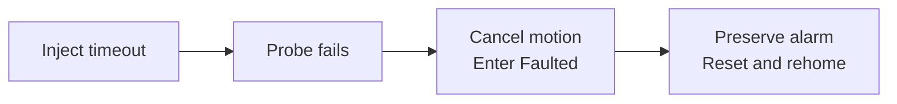
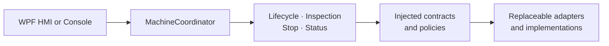
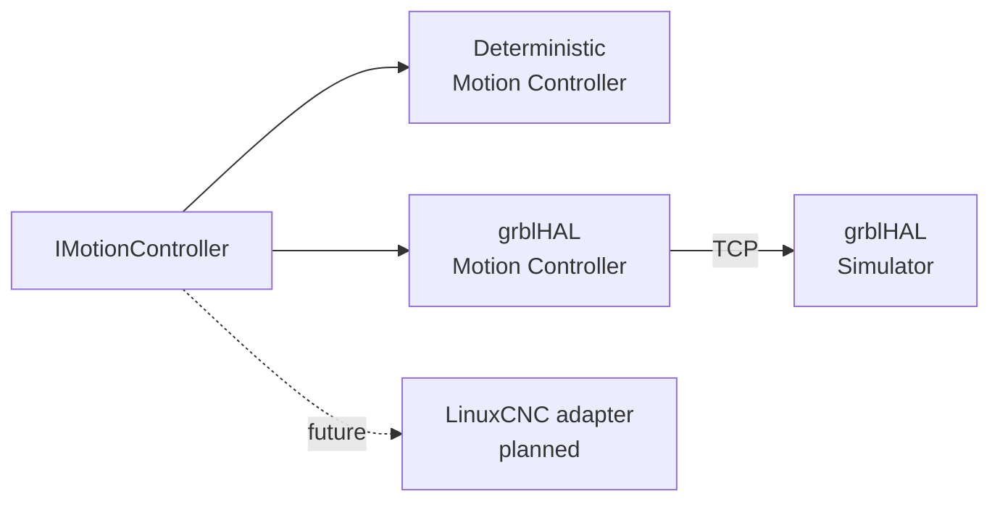

# Virtual Multi-Axis Motion Control Platform

<!-- DOC-NAV:START -->

[Home](README.md) · [Documentation](docs/README.md) · [Getting Started](docs/GETTING_STARTED.md) · [Architecture](docs/ARCHITECTURE.md) · [Testing](docs/TEST_STRATEGY.md) · [Implementation](docs/IMPLEMENTATION_GUIDE.md)

<!-- DOC-NAV:END -->

[](https://github.com/parthoece/multiaxis-motion-sim/actions/workflows/ci.yml)
[](https://github.com/parthoece/multiaxis-motion-sim/actions/workflows/windows-hmi.yml)
[](https://github.com/parthoece/multiaxis-motion-sim/actions/workflows/codeql.yml)
[](global.json)
[](#software-only-grblhal-backend)
[](configs/linuxcnc/)
[](LICENSE)
[](#scope-boundary)

> **Test industrial machine-control software before the physical machine exists.**

A software-in-the-loop virtual commissioning platform for deterministic XYZ motion, machine-state control, inspection workflows, fault injection, cancellation, recovery, persistence, and operator-interface testing.

Built with **C#/.NET, WPF, SQLite, xUnit, a TCP-connected grblHAL software simulator, and an independent LinuxCNC simulation profile**.

---

## Explore the project

| I want to… | Start here |
| --- | --- |
| Run a complete inspection cycle | [Run the normal scenario](#run-the-normal-scenario) |
| Reproduce a machine fault | [Inject a fault](#inject-a-fault) |
| Test operator Stop behavior | [Test operator Stop](#test-operator-stop) |
| Launch the Windows HMI | [Run the WPF HMI](#run-the-wpf-hmi) |
| Run the real grblHAL controller core in software | [Use the grblHAL backend](#software-only-grblhal-backend) |
| Understand the extension points | [Explore the architecture](#extensible-architecture) |
| Explore the LinuxCNC profile | [Open the LinuxCNC section](#linuxcnc-simulation-profile) |
| Review verification coverage | [Go to testing](#testing-and-verification) |

---

## The problem

Industrial machine-control software is often validated only after the mechanical structure, electrical system, controller, sensors, PLC signals, and operator station have been assembled.

That creates several problems:

- software defects become mixed with wiring, sensor, controller, and mechanical failures;
- access to the machine is limited and shared across engineering teams;
- every software correction may require another commissioning session;
- failures are discovered late, when they are more expensive to correct;
- abnormal conditions may be disruptive or unsafe to reproduce repeatedly.

Typical examples include a probe that does not trigger, incomplete homing, E-stop activation, communication loss, missing process permissives, operator cancellation, and movement approaching a configured software limit.

## The solution

This project provides a deterministic virtual machine and replaceable motion backends so equipment-software behavior can be tested before physical hardware is available.

It combines:

- a C#/.NET equipment-control application;
- a deterministic virtual Cartesian XYZ machine;
- a TCP adapter for the open-source grblHAL software simulator;
- simulated PLC permissives and process signals;
- versioned inspection recipes;
- repeatable fault injection;
- asynchronous cancellation and Stop handling;
- explicit alarm, reset, and recovery policies;
- SQLite operational history;
- JSON Lines diagnostic events;
- a Windows WPF operator interface;
- an independent LinuxCNC simulation profile.

The objective is not simply to animate three axes. It is to verify that the complete equipment workflow remains **controlled, diagnosable, replaceable, and recoverable** during normal and abnormal operation.

---

## What can be demonstrated

| Demonstration | Evidence |
| --- | --- |
| Deterministic workflow testing | Repeatable state transitions, faults, alarms, and recovery |
| External controller integration | TCP commands and live `MPos` status from grblHAL Simulator |
| Controller independence | The same application workflow uses multiple `IMotionController` backends |
| Operator interaction | State-aware WPF commands, live XYZ status, warnings, alarms, and measurements |
| Persistence | SQLite cycles, measurements, transitions, and alarms |
| Diagnostics | Append-friendly JSON Lines events |
| Recovery policy | Fault-specific reset targets and explicit rehoming requirements |
| Extension design | Replaceable motion, PLC, persistence, logging, time, and validation dependencies |

---

## Try it

### Requirements

- .NET SDK `10.0.302`, or a compatible SDK selected through `global.json`
- Git
- Windows 10 or 11 for the WPF HMI
- Python 3.10 or later for optional repository checks
- A locally built grblHAL Simulator executable for the optional grblHAL backend
- LinuxCNC only for the independent LinuxCNC profile

### Clone the repository

```bash
git clone https://github.com/parthoece/multiaxis-motion-sim.git
cd multiaxis-motion-sim
```

### Run the normal scenario

```bash
dotnet restore
dotnet run --project src/MotionControl.OperatorConsole -- normal
```

Expected machine-state sequence:

```text
OFF
→ INITIALIZING
→ NOT_HOMED
→ HOMING
→ READY
→ AUTOMATIC
→ READY
```

During the cycle, the virtual machine:

1. verifies startup permissives;
2. homes Z, X, and Y;
3. loads a five-point inspection recipe;
4. moves above each inspection point;
5. probes the virtual surface;
6. evaluates tolerances;
7. stores the completed cycle and measurements.

Console operational data is written under `.runtime/`.

---

## Pick a scenario

Each scenario is deterministic. Repeating the same scenario should produce the same state transitions, alarm, recovery target, and diagnostic evidence.

| Scenario | Command | What to observe |
| --- | --- | --- |
| Successful inspection | `normal` | Five measurements and a completed cycle |
| Operator Stop | `operator-stop` | Active-operation cancellation and deliberate recovery |
| Probe timeout | `probe-timeout` | Preserved primary alarm and required rehoming |
| Missing part | `part-missing` | Cycle permissive rejection |
| E-stop activation | `estop` | Faulted state and invalidated homing |
| PLC communication loss | `plc-loss` | Communication-fault handling |
| Out of tolerance | `out-of-tolerance` | Completed inspection with a failed process result |

Run any scenario with:

```bash
dotnet run --project src/MotionControl.OperatorConsole -- <scenario>
```

For example:

```bash
dotnet run --project src/MotionControl.OperatorConsole -- probe-timeout
```

> An out-of-tolerance part is a completed process result, not a machine-control fault.

---

## Inject a fault

A failure should be reproducible before it becomes a regression test.



<details>
<summary><strong>View the complete fault sequence</strong></summary>

1. Enable probe-timeout injection.
2. Start the inspection.
3. The simulated probe does not trigger.
4. Active motion is cancelled.
5. The machine enters `Faulted`.
6. `ProbeTimeout` remains the primary alarm.
7. Reset returns the machine to `NotHomed`.
8. Rehoming is required before another automatic cycle.

A secondary cancellation or cleanup event must not replace the original machine fault.

</details>

---

## Test operator Stop

```bash
dotnet run --project src/MotionControl.OperatorConsole -- operator-stop
```

Expected behavior:

```text
Automatic motion
→ operator presses Stop
→ active workflow is cancelled
→ motion completion is confirmed
→ OperationCancelled alarm is recorded
→ machine enters Faulted
→ operator resets
→ machine returns to Ready
```

The deterministic scenario exits successfully only when cancellation and recovery behavior are verified.

The grblHAL backend applies a stricter policy after an abort: controller position is treated as untrusted and rehoming is required.

---

## Extensible architecture

The system separates machine workflows from controller, I/O, storage, diagnostics, time, and validation technologies.



`MachineCoordinator` remains the presentation-facing facade. New workflows should be introduced as dedicated application services rather than embedding controller-specific behavior in the UI or domain model.

### Extension map

| Layer or seam | Current implementation | Extension examples |
| --- | --- | --- |
| Presentation | WPF HMI, operator console | Web HMI, maintenance console, automated commissioning client |
| Application workflows | Lifecycle, inspection, Stop, status | Manual jog, calibration, maintenance, recipe management, alarm history |
| Motion control | `IMotionController` | Deterministic simulator, grblHAL, LinuxCNC, physical controller adapters |
| PLC and process I/O | Virtual PLC gateway | OPC UA, EtherNet/IP, Modbus TCP, hardware PLC gateway |
| Operational storage | SQLite store | Alternative local store, remote database, export pipeline |
| Diagnostic events | JSON Lines event log | Structured telemetry, OpenTelemetry, centralized logging |
| Time | System clock | Fake clock, replay clock, accelerated simulation clock |
| Recipe rules | Recipe validator | Product-specific validation policies, schema versions, external recipe source |
| Fault and recovery policy | Domain rules and fault context | Controller-specific recovery constraints, machine-profile policies |

> `IMotionController` is the implemented motion contract. Other constructor-injected services and policies are deliberate extension seams that can be formalized further as additional implementations are introduced.

### Motion backends



Two backends are currently available:

- `DeterministicMotionController` for repeatable application-level testing;
- `GrblHalMotionController` for communication with the genuine grblHAL controller core through TCP.

The independent LinuxCNC profile remains a future adapter target.

<details>
<summary><strong>Explore current application responsibilities</strong></summary>

| Component | Responsibility |
| --- | --- |
| Lifecycle service | Initialization, homing, reset, and recovery |
| Inspection service | Recipe execution, probing, measurements, and tolerance evaluation |
| Stop service | Active-operation cancellation and completion confirmation |
| Status service | Continuous machine, axis, signal, alarm, and measurement status |
| Command gate | Prevents conflicting machine commands |
| Active operation | Tracks and cancels the current asynchronous workflow |
| Fault context | Preserves the primary fault and required recovery target |
| Persistence | Stores transitions, alarms, cycles, and measurements |
| Event log | Writes append-friendly JSON Lines diagnostic events |

See [Architecture](docs/ARCHITECTURE.md) for the complete design.

</details>

---

## Run the WPF HMI

Run the Windows operator interface with the default deterministic backend:

```powershell
dotnet run --project src/MotionControl.Hmi.Wpf
```

The HMI provides:

- state-aware command availability;
- continuous XYZ position status;
- movement indication;
- permissive and alarm summaries;
- operational-warning status;
- recent inspection measurements;
- deterministic probe-timeout controls.

WPF operational data is stored under the current user’s local application-data directory.

<details>
<summary><strong>Suggested deterministic HMI demonstration</strong></summary>

1. Select **Initialize**.
2. Select **Home All**.
3. Confirm the machine reaches `Ready`.
4. Run a normal inspection.
5. Review the five measurements.
6. Enable probe-timeout injection.
7. Start another inspection.
8. Observe cancellation and the preserved alarm.
9. Reset the machine.
10. Rehome and return to `Ready`.

</details>

<!--
Optional: add a real screenshot or short GIF when available.

<p align="center">
  
</p>
-->

---

## Software-only grblHAL backend

The WPF application can run against the open-source grblHAL controller core without a microcontroller, drives, motors, or physical machine.

```text
WPF HMI
   ↓
MachineCoordinator
   ↓
IMotionController
   ↓
GrblHalMotionController
   ↓ TCP 127.0.0.1:23000
grblHAL Simulator
```

### What is genuine and what is modeled

| Behavior | Source |
| --- | --- |
| G-code parsing and planning | grblHAL Simulator |
| XYZ movement execution | grblHAL Simulator |
| Controller state | grblHAL Simulator |
| `MPos` position reports | grblHAL Simulator |
| Status query, feed hold, and soft reset | grblHAL real-time protocol |
| Home-switch activation | Modeled by the .NET adapter in software-only mode |
| Probe contact | Modeled by the .NET adapter in software-only mode |
| Machine workflow and recovery | .NET application and domain rules |
| Persistence and diagnostics | SQLite and JSON Lines |

### Build or obtain grblHAL Simulator

The simulator executable is not committed to this repository.

Build the upstream grblHAL Simulator separately, then place the Windows executable at:

```text
tools/grblhal-sim/bin/grblHAL_sim.exe
```

A typical local build uses MSYS2 UCRT64, CMake, Ninja, GCC, and the upstream simulator source.

<details>
<summary><strong>Example local build commands</strong></summary>

Run these commands in an **MSYS2 UCRT64** terminal:

```bash
pacman -S --needed \
    git \
    mingw-w64-ucrt-x86_64-gcc \
    mingw-w64-ucrt-x86_64-cmake \
    mingw-w64-ucrt-x86_64-ninja

mkdir -p /c/src
cd /c/src

git clone --recurse-submodules \
    https://github.com/grblHAL/Simulator.git \
    grblhal-simulator

cd grblhal-simulator
git submodule update --init --recursive

cmake -S . -B build -G Ninja -DCMAKE_BUILD_TYPE=Release
cmake --build build --parallel
```

Copy the resulting executable into this repository:

```powershell
New-Item -ItemType Directory -Force `
    ".\tools\grblhal-sim\bin"

Copy-Item `
    "C:\src\grblhal-simulator\build\grblHAL_sim.exe" `
    ".\tools\grblhal-sim\bin\grblHAL_sim.exe" `
    -Force
```

The local executable and `EEPROM.DAT` are ignored by Git.

</details>

### Start grblHAL Simulator

Open the first PowerShell terminal:

```powershell
.\tools\grblhal-sim\bin\grblHAL_sim.exe -p 23000
```

Leave it running.

### Verify the TCP protocol

In a second terminal:

```powershell
powershell -NoProfile -ExecutionPolicy Bypass `
    -File scripts/Test-GrblHalSimulator.ps1
```

The smoke test verifies:

- TCP connection to `127.0.0.1:23000`;
- the grblHAL startup banner;
- `$I` controller information;
- the real-time `?` status response;
- an `Idle` report containing XYZ `MPos`.

### Run the WPF application with grblHAL

```powershell
$env:MOTION_BACKEND = "grblhal"
$env:GRBLHAL_HOST = "127.0.0.1"
$env:GRBLHAL_PORT = "23000"

dotnet run --project src/MotionControl.Hmi.Wpf
```

The adapter currently supports:

- TCP initialization;
- millimetre and absolute-position modes;
- XYZ G-code movement;
- real-time status and machine-position reporting;
- feed hold and soft reset;
- software-only homing;
- software-modeled probe contact;
- integration with the existing state, alarm, persistence, and HMI layers.

### Return to the deterministic backend

Close the HMI, then clear the environment variables:

```powershell
Remove-Item Env:MOTION_BACKEND -ErrorAction SilentlyContinue
Remove-Item Env:GRBLHAL_HOST -ErrorAction SilentlyContinue
Remove-Item Env:GRBLHAL_PORT -ErrorAction SilentlyContinue

dotnet run --project src/MotionControl.Hmi.Wpf
```

<details>
<summary><strong>Software-only grblHAL boundary</strong></summary>

This integration validates:

- TCP communication with the real grblHAL controller core;
- G-code command formatting and acknowledgement;
- controller status parsing;
- `MPos` mapping into application axis positions;
- motion completion monitoring;
- feed hold and reset behavior;
- adapter selection through configuration;
- integration with machine states, persistence, diagnostics, and the WPF HMI.

It does not validate:

- electrical home-switch signals;
- electrical probe signals;
- step-pulse timing on a microcontroller;
- motors, drives, encoders, or mechanics;
- physical limits or collision behavior;
- positioning accuracy;
- functional safety.

</details>

---

## LinuxCNC simulation profile

Run the independent LinuxCNC profile on a LinuxCNC system:

```bash
linuxcnc configs/linuxcnc/xyz-3axis/machine.ini
```

The profile includes:

- three simulated Cartesian axes;
- homing configuration;
- configured software limits;
- HAL configuration;
- coordinated-motion programs;
- probing G-code.

The LinuxCNC profile is currently independent of the .NET application.

A future `LinuxCncMotionController` adapter is planned to implement `IMotionController` without changing equipment-domain rules.

<details>
<summary><strong>Why keep LinuxCNC behind an adapter?</strong></summary>

The application should not contain controller-specific rules.

The adapter boundary allows the same machine workflow to operate with:

- the deterministic in-process simulator;
- grblHAL Simulator;
- LinuxCNC;
- a future physical motion controller.

Controller communication can change without rewriting machine states, recipes, alarm policy, or recovery behavior.

</details>

---

## Diagnostics and operational evidence

The platform records two complementary forms of evidence:

| Store | Purpose |
| --- | --- |
| SQLite | Transactional machine transitions, alarms, cycles, and measurements |
| JSON Lines | Append-friendly diagnostic events for troubleshooting and inspection |

This supports both structured operational history and portable event-level diagnostics.

<details>
<summary><strong>What should be diagnosable after a failure?</strong></summary>

A repeatable fault should leave enough evidence to answer:

- Which command was active?
- Which permissive or signal changed?
- Which motion backend was selected?
- What was the primary alarm?
- Was active motion cancelled?
- Which machine state followed?
- What recovery target was selected?
- Was rehoming required?
- Which secondary warnings occurred?

</details>

---

## Testing and verification

Run the complete .NET test suite:

```bash
dotnet test
```

Run individual test projects:

```bash
dotnet test tests/MotionControl.Domain.Tests
dotnet test tests/MotionControl.Application.Tests
dotnet test tests/MotionControl.IntegrationTests
```

Run repository checks:

```bash
python scripts/check_architecture.py
python scripts/check_docs.py
```

On a compatible shell:

```bash
./scripts/check.sh
```

Run the manual grblHAL TCP smoke test while the simulator is listening:

```powershell
powershell -NoProfile -ExecutionPolicy Bypass `
    -File scripts/Test-GrblHalSimulator.ps1
```

Verification coverage includes:

- domain rules and machine-state transitions;
- initialization and homing;
- inspection workflows;
- cancellation and Stop behavior;
- primary-fault preservation and recovery;
- continuous status reporting;
- SQLite persistence;
- JSON Lines diagnostics;
- architecture dependency rules;
- documentation integrity;
- manual communication with the grblHAL software simulator.

> The normal automated test suite does not require a locally running grblHAL process. Dedicated fake-transport and controller-contract tests are the next reliability milestone.

The workflow badges at the top of this README show the latest authoritative CI, Windows HMI, and CodeQL status.

---

## Recovery policy

Reset does not automatically restart motion.

<details>
<summary><strong>View recovery targets</strong></summary>

| Fault condition | Recovery target |
| --- | --- |
| Missing part | `Ready` |
| Air pressure unavailable | `Ready` |
| Operator cancellation | `Ready` in the deterministic simulator |
| External-controller abort | `NotHomed` |
| Probe timeout | `NotHomed` |
| Homing failure | `NotHomed` |
| Software-limit violation | `NotHomed` |
| E-stop activation | `NotHomed` |
| Motion controller unavailable | `Off` |
| Unexpected startup failure | `Off` |

The grblHAL backend intentionally applies stricter recovery after a feed hold followed by soft reset because the application no longer treats the controller position as trusted.

</details>

---

## Repository map

<details>
<summary><strong>Open repository structure</strong></summary>

```text
multiaxis-motion-sim/
├── src/
│   ├── MotionControl.Domain/
│   ├── MotionControl.Application/
│   ├── MotionControl.Simulation/
│   ├── MotionControl.GrblHal/         # TCP adapter for grblHAL Simulator
│   ├── MotionControl.Persistence/
│   ├── MotionControl.OperatorConsole/
│   └── MotionControl.Hmi.Wpf/
├── tests/
│   ├── MotionControl.Domain.Tests/
│   ├── MotionControl.Application.Tests/
│   └── MotionControl.IntegrationTests/
├── tools/
│   └── grblhal-sim/
│       └── bin/                       # Local executable; ignored by Git
├── configs/linuxcnc/
├── gcode/
├── docs/
├── scripts/
│   └── Test-GrblHalSimulator.ps1
└── .github/
```

</details>

---

## Project direction

Current development priorities include:

- adding fake-transport tests for the grblHAL protocol adapter;
- adding shared `IMotionController` contract tests;
- exposing the selected motion backend in the HMI;
- improving disconnect and reconnect handling;
- completing the WPF manual test matrix;
- verifying the LinuxCNC profile in its target environment;
- adding alarm-history and recipe-management interfaces;
- implementing the .NET-to-LinuxCNC adapter;
- evaluating real controller I/O after the software-only path is stable.

See the [Development Plan](docs/DEVELOPMENT_PLAN.md) for the detailed roadmap.

---

## Scope boundary

This project validates software behavior, including:

- equipment architecture;
- machine-state transitions;
- coordinated-motion commands;
- controller adapter boundaries;
- G-code command and status integration;
- homing policy;
- software limits;
- simulated PLC handshakes;
- recipes and inspection logic;
- alarms and recovery;
- persistence;
- command concurrency;
- cancellation;
- deterministic failure scenarios.

It does **not** validate:

- physical positioning accuracy or repeatability;
- backlash, stiffness, vibration, or thermal behavior;
- motor, drive, or power-supply sizing;
- electrical-noise immunity;
- real sensor performance;
- physical collision dynamics;
- emergency-stop hardware performance;
- functional-safety integrity;
- machinery-safety compliance.

> This is a simulation-only project. Physical performance and safety claims require separate hardware validation.

---

## Third-party software

grblHAL and LinuxCNC are independent open-source projects.

This repository does not redistribute the locally built grblHAL Simulator executable. Users build or obtain it separately and must follow the upstream project’s licensing terms.

The .NET application, adapters, tests, documentation, and simulation-specific integration code in this repository are released under this project’s license.

---

## Continue exploring

| Topic | Document |
| --- | --- |
| Install and run | [Getting Started](docs/GETTING_STARTED.md) |
| Understand the design | [Architecture](docs/ARCHITECTURE.md) |
| Follow the implementation | [Implementation Guide](docs/IMPLEMENTATION_GUIDE.md) |
| Review verification coverage | [Test Strategy](docs/TEST_STRATEGY.md) |
| Follow planned work | [Development Plan](docs/DEVELOPMENT_PLAN.md) |
| Prepare a portfolio demonstration | [Portfolio Review](docs/PORTFOLIO_REVIEW.md) |
| Prepare for technical discussion | [Interview Preparation](docs/INTERVIEW_PREP.md) |
| Browse all documentation | [Documentation Index](docs/README.md) |

## License

Released under the [MIT License](LICENSE).

---

<!-- DOC-FOOTER:START -->

[Documentation index](docs/README.md) · [Back to top](#virtual-multi-axis-motion-control-platform)

<!-- DOC-FOOTER:END -->
