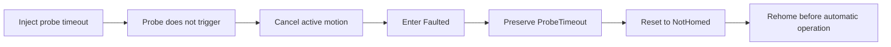

# Virtual Multi-Axis Motion Control Platform

<!-- DOC-NAV:START -->

[Home](README.md) · [Documentation](docs/README.md) · [Getting Started](docs/GETTING_STARTED.md) · [Architecture](docs/ARCHITECTURE.md) · [Testing](docs/TEST_STRATEGY.md) · [Implementation](docs/IMPLEMENTATION_GUIDE.md)

<!-- DOC-NAV:END -->

[](https://github.com/parthoece/multiaxis-motion-sim/actions/workflows/ci.yml)
[](https://github.com/parthoece/multiaxis-motion-sim/actions/workflows/windows-hmi.yml)
[](https://github.com/parthoece/multiaxis-motion-sim/actions/workflows/codeql.yml)
[](global.json)
[](LICENSE)
[](#scope-and-safety-boundary)

> **Test industrial machine-control software before the physical machine exists.**

A software-in-the-loop virtual commissioning platform for deterministic XYZ motion, machine-state control, inspection workflows, fault injection, operator cancellation, recovery, persistence, diagnostics, and HMI testing.

Built with **C#/.NET, WPF, SQLite, xUnit, and grblHAL Simulator**. Digital Twin and physical-controller integrations are planned adapter extensions.

<p align="center">
  
</p>

<p align="center">
  <em>Initialize → Home → Inspect → Inject fault → Reset → Rehome</em>
</p>

<!--
Before publication, add the real capture at docs/assets/hmi-demo.gif.
Capture and optimization guidance: docs/GETTING_STARTED.md#add-the-demo-gif
-->

## At a glance

| Area | Current status |
| --- | --- |
| Core workflows and recovery | Implemented |
| Deterministic XYZ simulation | Implemented |
| WPF operator HMI | Implemented baseline |
| grblHAL TCP backend | Implemented baseline; upstream simulator is built separately |
| SQLite and JSON Lines evidence | Runtime persistence implemented |
| Digital Twin and physical controller | Planned through the existing adapter seam |
| Physical performance and safety | Not validated by this project |

**Project maturity:** portfolio-quality software-in-the-loop prototype; not production machinery software.

## Quick start

This section contains the complete command path for restoring, testing, running deterministic scenarios, opening the WPF HMI, and running the HMI through grblHAL. Detailed prerequisites, expected outputs, troubleshooting, runtime locations, and GIF publication steps are in [Getting Started](docs/GETTING_STARTED.md). Build internals, recovery policy, adapter boundaries, and extended evidence requirements are in the [Implementation Guide](docs/IMPLEMENTATION_GUIDE.md).

### Requirements

- .NET SDK `10.0.302`, or the compatible SDK selected through `global.json`
- Git
- Windows 10 or 11 for the WPF HMI
- Python 3.10 or later for optional repository checks
- A separately built grblHAL Simulator executable for the grblHAL path

### 1. Clone, restore, build, and test

```bash
git clone https://github.com/parthoece/multiaxis-motion-sim.git
cd multiaxis-motion-sim

dotnet --info
dotnet restore
dotnet build --configuration Release
dotnet test --configuration Release
```

### 2. Run the deterministic console workflow

```bash
dotnet run --project src/MotionControl.OperatorConsole -- normal
```

Expected state sequence:

```text
OFF
→ INITIALIZING
→ NOT_HOMED
→ HOMING
→ READY
→ AUTOMATIC
→ READY
```

Run the remaining deterministic scenarios:

```bash
dotnet run --project src/MotionControl.OperatorConsole -- operator-stop
dotnet run --project src/MotionControl.OperatorConsole -- probe-timeout
dotnet run --project src/MotionControl.OperatorConsole -- part-missing
dotnet run --project src/MotionControl.OperatorConsole -- estop
dotnet run --project src/MotionControl.OperatorConsole -- plc-loss
dotnet run --project src/MotionControl.OperatorConsole -- out-of-tolerance
```

Console runtime evidence is written under `.runtime/`.

### 3. Open the WPF HMI with the deterministic adapter

Run from the repository root in Windows PowerShell:

```powershell
Remove-Item Env:MOTION_BACKEND -ErrorAction SilentlyContinue
Remove-Item Env:GRBLHAL_HOST -ErrorAction SilentlyContinue
Remove-Item Env:GRBLHAL_PORT -ErrorAction SilentlyContinue

dotnet run --project src/MotionControl.Hmi.Wpf
```

With no backend variable set, the application creates `DeterministicMotionController`.

Suggested demonstration sequence:

1. Select **Initialize**.
2. Select **Home All**.
3. Run a normal inspection.
4. Review the five measurements.
5. Arm probe-timeout injection.
6. Run the inspection again.
7. Observe the preserved primary alarm.
8. Clear the injected fault, reset, and rehome.

### 4. Open the WPF HMI through grblHAL

The grblHAL integration uses its line-based TCP command/status and real-time protocol. It is not an HTTP or REST API.

The simulator executable must already exist at:

```text
tools/grblhal-sim/bin/grblHAL_sim.exe
```

**Terminal 1 — start grblHAL Simulator**

```powershell
.\tools\grblhal-sim\bin\grblHAL_sim.exe -p 23000
```

**Terminal 2 — verify the TCP interface**

```powershell
powershell -NoProfile -ExecutionPolicy Bypass `
    -File scripts/Test-GrblHalSimulator.ps1
```

**Terminal 3 — select `GrblHalMotionController` and open the HMI**

```powershell
$env:MOTION_BACKEND = "grblhal"
$env:GRBLHAL_HOST = "127.0.0.1"
$env:GRBLHAL_PORT = "23000"

dotnet run --project src/MotionControl.Hmi.Wpf
```

Return to the deterministic adapter:

```powershell
Remove-Item Env:MOTION_BACKEND -ErrorAction SilentlyContinue
Remove-Item Env:GRBLHAL_HOST -ErrorAction SilentlyContinue
Remove-Item Env:GRBLHAL_PORT -ErrorAction SilentlyContinue
```

The upstream simulator build procedure is kept in the [Implementation Guide](docs/IMPLEMENTATION_GUIDE.md). Operational setup and expected smoke-test responses are in [Getting Started](docs/GETTING_STARTED.md).

### 5. Run repository checks

```bash
python scripts/check_architecture.py
python scripts/check_docs.py
```

On a compatible shell:

```bash
./scripts/check.sh
```

## What the system demonstrates

- **Equipment architecture:** presentation, workflows, domain rules, adapters, persistence, and diagnostics remain separated.
- **Machine-state control:** explicit initialization, homing, automatic operation, fault, reset, and recovery behavior.
- **Reliable asynchronous control:** command exclusion, active-operation cancellation, Stop handling, and completion confirmation.
- **Fault handling:** repeatable probe, PLC, E-stop, permissive, cancellation, and limit-related scenarios with primary-fault preservation.
- **Operator experience:** state-aware WPF commands, live XYZ position, alarms, warnings, measurements, and cycle indicators.
- **Operational evidence:** SQLite history and append-friendly JSON Lines diagnostics.
- **Extensibility:** replaceable controller, PLC, storage, logging, timing, and validation dependencies.

The objective is not merely to animate three axes. It is to verify that the complete equipment workflow remains **controlled, diagnosable, replaceable, and recoverable** during normal and abnormal operation.

## System architecture

<p align="center">
  
</p>

```text
WPF HMI or Console
        ↓
MachineCoordinator
        ↓
Lifecycle · Inspection · Stop · Status services
        ↓
Injected contracts and policies
        ↓
Motion adapter · Virtual PLC · SQLite · JSON Lines
```

`MachineCoordinator` is the presentation-facing facade. New workflows belong in focused application services rather than the UI, domain model, or controller adapter.

| Motion adapter | Runtime | Purpose |
| --- | --- | --- |
| `DeterministicMotionController` | In-process | Repeatable workflow, fault, cancellation, and recovery testing |
| `GrblHalMotionController` | TCP to grblHAL Simulator | G-code commands, acknowledgements, status, `MPos`, feed hold, and reset integration |
| Digital Twin or physical adapter | Planned | Reuse the same application and domain rules through `IMotionController` |

See [Architecture](docs/ARCHITECTURE.md) for dependency direction, component responsibilities, and runtime flows.

## Demonstrated scenarios

Repeating a deterministic scenario should produce the same state transitions, primary alarm, recovery target, and diagnostic evidence.

| Scenario | Argument | Expected result |
| --- | --- | --- |
| Successful inspection | `normal` | Five measurements and a completed cycle |
| Operator Stop | `operator-stop` | Active workflow cancellation and deliberate recovery |
| Probe timeout | `probe-timeout` | Primary alarm preserved; rehoming required |
| Missing part | `part-missing` | Cycle rejected because a process permissive is unavailable |
| E-stop activation | `estop` | Faulted state and invalidated homing |
| PLC communication loss | `plc-loss` | Communication-fault handling |
| Out of tolerance | `out-of-tolerance` | Completed inspection with a failed process result |

> An out-of-tolerance part is a completed process result, not a machine-control fault.

## Windows WPF HMI

The WPF HMI presents the same machine workflows used by the console through an operator-focused interface. The implemented baseline includes:

- state-aware command enablement;
- guided initialization, homing, inspection, fault, and recovery flows;
- continuous XYZ position and movement indication;
- permissive, alarm, warning, and measurement summaries;
- cycle KPI cards and response logging;
- deterministic fault-injection controls for software-only demonstrations.

The HMI is supported on Windows 10 and 11. Its operational data is stored in the current user's local application-data directory rather than the console `.runtime/` directory.

## grblHAL command and status interface

The .NET adapter communicates with grblHAL Simulator over TCP:

```text
WPF HMI
  → MachineCoordinator
  → IMotionController
  → GrblHalMotionController
  → TCP 127.0.0.1:23000
  → grblHAL Simulator
```

The integration uses a focused part of the grblHAL command/status surface:

| Interface | Use in this project |
| --- | --- |
| `$I` | Controller information during smoke testing |
| `?` | Real-time controller status query |
| `G21` | Millimetre units |
| `G90` | Absolute positioning |
| XYZ G-code movement | Commanded motion through the controller core |
| `ok` / `error:` responses | Command acknowledgement and failure mapping |
| `MPos` status field | Application XYZ position reporting |
| Feed hold | Controlled interruption of active motion |
| Soft reset | Controller reset and stricter recovery handling |

| Behavior | Source |
| --- | --- |
| G-code parsing and planning | grblHAL Simulator |
| XYZ movement execution | grblHAL Simulator |
| Controller state and `MPos` reports | grblHAL Simulator |
| Status query, feed hold, and soft reset | grblHAL real-time protocol |
| Home-switch activation | Modeled by the .NET adapter |
| Probe contact | Modeled by the .NET adapter |
| Machine workflow and recovery policy | .NET application and domain rules |
| Persistence and diagnostics | SQLite and JSON Lines |

This validates TCP communication, command formatting, acknowledgement, status parsing, reported machine position, motion-completion monitoring, feed hold, reset behavior, backend selection, and integration with machine states and diagnostics.

It does not validate electrical I/O, microcontroller step timing, motors, drives, mechanics, positioning accuracy, collision behavior, or functional safety.

## Fault handling and recovery

A machine fault is captured before cleanup begins. Secondary cancellation, persistence, diagnostic, or PLC-output failures must not replace the primary alarm.



Reset does not automatically restart motion. Recovery is fault-specific: process-permissive faults may return to `Ready`, while probe, homing, limit, E-stop, and external-controller abort conditions require rehoming. Controller-unavailable and unexpected startup failures return to `Off`.

The complete recovery matrix and fault-handling order are documented in the [Implementation Guide](docs/IMPLEMENTATION_GUIDE.md) and [Architecture](docs/ARCHITECTURE.md).

## Persistence and diagnostics

| Evidence store | Purpose |
| --- | --- |
| SQLite | Transactional transitions, alarms, cycles, and measurements |
| JSON Lines | Append-friendly diagnostic events for troubleshooting and review |

Together, these records are intended to identify the active command, selected backend, changed permissive or signal, primary alarm, cancellation outcome, next machine state, and required recovery target.

Schema migrations, history queries, retention guidance, and diagnostic export remain planned improvements.

## Testing and verification

Verification covers:

- domain rules and machine-state transitions;
- initialization, homing, inspection, cancellation, and Stop behavior;
- primary-fault preservation and recovery policy;
- continuous status reporting;
- SQLite persistence and JSON Lines diagnostics;
- architecture dependency rules and documentation integrity;
- manual grblHAL TCP communication.

The standard automated suite does not require a running grblHAL process. The manual TCP smoke test requires the simulator to be listening.

Shared `IMotionController` contract tests, deeper grblHAL fake-transport coverage, disconnect handling, and the WPF manual-test matrix are current reliability priorities.

## Repository structure

```text
multiaxis-motion-sim/
├── src/
│   ├── MotionControl.Domain/
│   ├── MotionControl.Application/
│   ├── MotionControl.Simulation/
│   ├── MotionControl.GrblHal/
│   ├── MotionControl.Persistence/
│   ├── MotionControl.OperatorConsole/
│   └── MotionControl.Hmi.Wpf/
├── tests/
│   ├── MotionControl.Domain.Tests/
│   ├── MotionControl.Application.Tests/
│   └── MotionControl.IntegrationTests/
├── tools/grblhal-sim/bin/
├── configs/
├── gcode/
├── docs/
├── scripts/
└── .github/
```

## Roadmap

Near-term priorities are:

- publish the real WPF demonstration GIF and release evidence;
- add shared `IMotionController` contract tests;
- strengthen grblHAL transport, timeout, and disconnect tests;
- expose the selected backend and connection quality clearly in the HMI;
- complete the WPF manual-test matrix;
- add SQLite migrations, history queries, and diagnostic export;
- add alarm-history and recipe-management interfaces.

Digital Twin and physical-controller adapters are later extensions through the existing motion-controller seam.

See the [Development Plan](docs/DEVELOPMENT_PLAN.md) and [Implementation Guide](docs/IMPLEMENTATION_GUIDE.md) for ordered milestones.

## Scope and safety boundary

This project validates software behavior, including architecture, state transitions, coordinated-motion commands, controller-adapter boundaries, G-code command and status integration, software limits, virtual PLC handshakes, recipes, alarms, recovery, persistence, command concurrency, cancellation, and deterministic failure scenarios.

It does **not** validate:

- physical positioning accuracy or repeatability;
- backlash, stiffness, vibration, or thermal behavior;
- motor, drive, or power-supply sizing;
- electrical-noise immunity or real sensor performance;
- physical collision dynamics;
- emergency-stop hardware performance;
- functional-safety integrity or machinery-safety compliance.

> This is a simulation-only project. Physical performance and safety claims require separate hardware validation.

## Documentation and references

| Goal | Document |
| --- | --- |
| Install, run, troubleshoot, and add the demo GIF | [Getting Started](docs/GETTING_STARTED.md) |
| Understand components, dependencies, and runtime flows | [Architecture](docs/ARCHITECTURE.md) |
| Review implementation order, recovery policy, and adapter boundaries | [Implementation Guide](docs/IMPLEMENTATION_GUIDE.md) |
| Review automated and manual verification coverage | [Test Strategy](docs/TEST_STRATEGY.md) |
| Follow ordered future work | [Development Plan](docs/DEVELOPMENT_PLAN.md) |
| Prepare the public demonstration | [Portfolio Review](docs/PORTFOLIO_REVIEW.md) |
| Prepare for technical discussion | [Interview Preparation](docs/INTERVIEW_PREP.md) |
| Review standards, upstream projects, and engineering sources | [References](docs/REFERENCES.md) |
| Browse all documentation | [Documentation Index](docs/README.md) |

## Third-party software

grblHAL is an independent open-source project. This repository does not redistribute the locally built grblHAL Simulator executable. Users must obtain or build it separately and comply with the upstream project's licensing terms. See [References](docs/REFERENCES.md) for upstream and engineering sources used by the project.

## License

Released under the [MIT License](LICENSE).

---

<!-- DOC-FOOTER:START -->

[Documentation index](docs/README.md) · [References](docs/REFERENCES.md) · [Back to top](#virtual-multi-axis-motion-control-platform)

<!-- DOC-FOOTER:END -->
