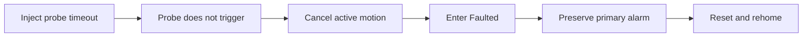
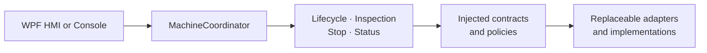
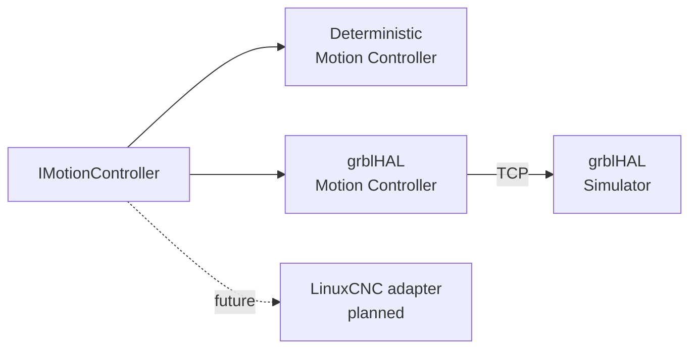

# Virtual Multi-Axis Motion Control Platform

<!-- DOC-NAV:START -->

[Home](README.md) · [Documentation](docs/README.md) · [Getting Started](docs/GETTING_STARTED.md) · [Architecture](docs/ARCHITECTURE.md) · [Testing](docs/TEST_STRATEGY.md) · [Implementation](docs/IMPLEMENTATION_GUIDE.md)

<!-- DOC-NAV:END -->

[](https://github.com/parthoece/multiaxis-motion-sim/actions/workflows/ci.yml)
[](https://github.com/parthoece/multiaxis-motion-sim/actions/workflows/windows-hmi.yml)
[](https://github.com/parthoece/multiaxis-motion-sim/actions/workflows/codeql.yml)
[](global.json)
[](#grblhal-software-backend)
[](#linuxcnc-simulation-profile)
[](LICENSE)
[](#scope-and-safety-boundary)

> **Test industrial machine-control software before the physical machine exists.**

A software-in-the-loop virtual commissioning platform for deterministic XYZ motion, machine-state control, inspection workflows, fault injection, operator cancellation, recovery, persistence, and HMI testing.

Built with **C#/.NET, WPF, SQLite, xUnit, grblHAL Simulator, and LinuxCNC simulation tooling**.

---

## Why this project exists

Industrial control software is often tested only after the machine, electrical system, PLC, controller, sensors, and operator station have been assembled.

At that stage:

* software defects are difficult to separate from wiring, sensor, controller, and mechanical problems;
* machine access is limited and shared across engineering teams;
* every correction may require another commissioning session;
* failures are discovered late, when they are more expensive to fix;
* abnormal conditions may be unsafe or disruptive to reproduce repeatedly.

This project moves a significant part of that validation earlier.

It provides a deterministic virtual machine and replaceable motion backends so equipment workflows can be exercised before physical hardware is available.

---

## What this project demonstrates

| Engineering area       | Demonstrated capability                                                                          |
| ---------------------- | ------------------------------------------------------------------------------------------------ |
| Equipment architecture | Separation between presentation, workflows, domain rules, adapters, persistence, and diagnostics |
| Motion control         | Deterministic XYZ simulation and TCP-connected grblHAL integration                               |
| Machine-state design   | Explicit initialization, homing, automatic operation, fault, reset, and recovery behavior        |
| Fault handling         | Repeatable probe, PLC, E-stop, permissive, cancellation, and limit-related scenarios             |
| Asynchronous control   | Active-operation cancellation, Stop handling, and command-conflict prevention                    |
| Recovery policy        | Fault-specific reset targets and explicit rehoming requirements                                  |
| Operator interface     | State-aware WPF commands, live position, alarms, warnings, and measurement status                |
| Persistence            | SQLite history for cycles, measurements, transitions, and alarms                                 |
| Diagnostics            | Append-friendly JSON Lines event records                                                         |
| Testability            | Deterministic scenarios, xUnit coverage, architecture checks, and documentation validation       |
| Extensibility          | Replaceable controller, PLC, storage, logging, timing, and validation dependencies               |

The goal is not simply to animate three axes. The goal is to verify that the complete equipment workflow remains **controlled, diagnosable, replaceable, and recoverable** during normal and abnormal operation.

---

## Quick demonstration

Run the default deterministic scenario:

```bash
git clone https://github.com/parthoece/multiaxis-motion-sim.git
cd multiaxis-motion-sim

dotnet restore
dotnet run --project src/MotionControl.OperatorConsole -- normal
```

Expected machine-state sequence:

```text
OFF
→ INITIALIZING
→ NOT_HOMED
→ HOMING
→ READY
→ AUTOMATIC
→ READY
```

During the cycle, the virtual machine:

1. verifies startup permissives;
2. homes the Z, X, and Y axes;
3. loads a five-point inspection recipe;
4. moves above each inspection point;
5. probes the virtual surface;
6. evaluates measurement tolerances;
7. stores the completed cycle and measurements.

Operational data is written under `.runtime/`.

---

## Demo scenarios

Each scenario is deterministic. Repeating the same command should produce the same state transitions, primary alarm, recovery target, and diagnostic evidence.

| Scenario               | Command            | Expected result                                            |
| ---------------------- | ------------------ | ---------------------------------------------------------- |
| Successful inspection  | `normal`           | Five measurements and a completed cycle                    |
| Operator Stop          | `operator-stop`    | Active workflow cancellation and controlled recovery       |
| Probe timeout          | `probe-timeout`    | Preserved primary alarm and required rehoming              |
| Missing part           | `part-missing`     | Cycle rejected because a process permissive is unavailable |
| E-stop activation      | `estop`            | Faulted state and invalidated homing                       |
| PLC communication loss | `plc-loss`         | Communication-fault handling                               |
| Out of tolerance       | `out-of-tolerance` | Completed inspection with a failed process result          |

Run a scenario with:

```bash
dotnet run --project src/MotionControl.OperatorConsole -- <scenario>
```

Example:

```bash
dotnet run --project src/MotionControl.OperatorConsole -- probe-timeout
```

> An out-of-tolerance part is a completed process result, not a machine-control fault.

---

## Fault handling and recovery

A failure should be reproducible before it becomes a regression test.



### Probe-timeout sequence

1. Probe-timeout injection is enabled.
2. The inspection begins.
3. The simulated probe does not trigger.
4. Active motion is cancelled.
5. The machine enters `Faulted`.
6. `ProbeTimeout` remains the primary alarm.
7. Reset returns the machine to `NotHomed`.
8. Rehoming is required before another automatic cycle.

A secondary cancellation or cleanup event must never replace the original machine fault.

### Operator Stop sequence

```bash
dotnet run --project src/MotionControl.OperatorConsole -- operator-stop
```

Expected behavior:

```text
Automatic motion
→ operator presses Stop
→ active workflow is cancelled
→ motion completion is confirmed
→ OperationCancelled alarm is recorded
→ machine enters Faulted
→ operator resets
→ machine returns to Ready
```

The grblHAL backend applies a stricter policy after an abort. Controller position is treated as untrusted, so rehoming is required.

---

## Architecture

The system separates machine workflows from controller communication, process I/O, persistence, diagnostics, timing, and validation technologies.



`MachineCoordinator` acts as the presentation-facing facade.

New workflows should be implemented as dedicated application services rather than placing controller-specific behavior in the UI or domain model.

### Application responsibilities

| Component          | Responsibility                                                    |
| ------------------ | ----------------------------------------------------------------- |
| Lifecycle service  | Initialization, homing, reset, and recovery                       |
| Inspection service | Recipe execution, probing, measurements, and tolerance evaluation |
| Stop service       | Active-operation cancellation and completion confirmation         |
| Status service     | Continuous machine, axis, signal, alarm, and measurement status   |
| Command gate       | Prevents conflicting machine commands                             |
| Active operation   | Tracks and cancels the current asynchronous workflow              |
| Fault context      | Preserves the primary fault and required recovery target          |
| Persistence        | Stores transitions, alarms, cycles, and measurements              |
| Event log          | Writes append-friendly JSON Lines events                          |

### Extension points

| Layer or seam         | Current implementation              | Possible extensions                                              |
| --------------------- | ----------------------------------- | ---------------------------------------------------------------- |
| Presentation          | WPF HMI, operator console           | Web HMI, maintenance console, commissioning client               |
| Application workflows | Lifecycle, inspection, Stop, status | Jogging, calibration, maintenance, recipe management             |
| Motion control        | `IMotionController`                 | Deterministic simulator, grblHAL, LinuxCNC, physical controller  |
| PLC and process I/O   | Virtual PLC gateway                 | OPC UA, EtherNet/IP, Modbus TCP                                  |
| Operational storage   | SQLite                              | Remote database, alternative local store, export pipeline        |
| Diagnostics           | JSON Lines                          | OpenTelemetry, centralized logging, structured telemetry         |
| Time                  | System clock                        | Fake clock, replay clock, accelerated simulation clock           |
| Recipe validation     | Recipe validator                    | Product-specific rules, external recipe sources, schema versions |
| Recovery rules        | Domain policies and fault context   | Controller-specific and machine-profile policies                 |

See [Architecture](docs/ARCHITECTURE.md) for the complete design.

---

## Motion backends



Two application backends are currently available:

* `DeterministicMotionController` for repeatable application-level testing;
* `GrblHalMotionController` for TCP communication with the grblHAL controller core.

The LinuxCNC profile currently runs independently and remains a future adapter target.

---

## Windows WPF HMI

Run the operator interface with the default deterministic backend:

```powershell
dotnet run --project src/MotionControl.Hmi.Wpf
```

The HMI provides:

* state-aware command availability;
* continuous XYZ position reporting;
* movement indication;
* permissive and alarm summaries;
* operational warnings;
* recent inspection measurements;
* deterministic probe-timeout controls.

WPF operational data is stored in the current user’s local application-data directory.

### Suggested HMI demonstration

1. Select **Initialize**.
2. Select **Home All**.
3. Confirm that the machine reaches `Ready`.
4. Run a normal inspection.
5. Review the five measurements.
6. Enable probe-timeout injection.
7. Start another inspection.
8. Observe cancellation and the preserved primary alarm.
9. Reset the machine.
10. Rehome and return to `Ready`.

<!--
Add a real screenshot or short GIF when available.

<p align="center">
  
</p>
-->

---

## grblHAL software backend

The WPF application can run against the open-source grblHAL controller core without a microcontroller, motors, drives, or physical machine.

```text
WPF HMI
   ↓
MachineCoordinator
   ↓
IMotionController
   ↓
GrblHalMotionController
   ↓ TCP 127.0.0.1:23000
grblHAL Simulator
```

### Genuine and modeled behavior

| Behavior                                | Source                            |
| --------------------------------------- | --------------------------------- |
| G-code parsing and planning             | grblHAL Simulator                 |
| XYZ movement execution                  | grblHAL Simulator                 |
| Controller state                        | grblHAL Simulator                 |
| `MPos` position reports                 | grblHAL Simulator                 |
| Status query, feed hold, and soft reset | grblHAL real-time protocol        |
| Home-switch activation                  | Modeled by the .NET adapter       |
| Probe contact                           | Modeled by the .NET adapter       |
| Machine workflow and recovery           | .NET application and domain rules |
| Persistence and diagnostics             | SQLite and JSON Lines             |

### Prepare the simulator

The simulator executable is not committed to this repository.

Build the upstream grblHAL Simulator separately, then place the Windows executable at:

```text
tools/grblhal-sim/bin/grblHAL_sim.exe
```

<details>
<summary><strong>Example MSYS2 build</strong></summary>

Run in an **MSYS2 UCRT64** terminal:

```bash
pacman -S --needed \
    git \
    mingw-w64-ucrt-x86_64-gcc \
    mingw-w64-ucrt-x86_64-cmake \
    mingw-w64-ucrt-x86_64-ninja

mkdir -p /c/src
cd /c/src

git clone --recurse-submodules \
    https://github.com/grblHAL/Simulator.git \
    grblhal-simulator

cd grblhal-simulator
git submodule update --init --recursive

cmake -S . -B build -G Ninja -DCMAKE_BUILD_TYPE=Release
cmake --build build --parallel
```

Copy the resulting executable:

```powershell
New-Item -ItemType Directory -Force `
    ".\tools\grblhal-sim\bin"

Copy-Item `
    "C:\src\grblhal-simulator\build\grblHAL_sim.exe" `
    ".\tools\grblhal-sim\bin\grblHAL_sim.exe" `
    -Force
```

The executable and `EEPROM.DAT` are ignored by Git.

</details>

### Start the simulator

```powershell
.\tools\grblhal-sim\bin\grblHAL_sim.exe -p 23000
```

Leave the process running.

### Verify the TCP protocol

In a second terminal:

```powershell
powershell -NoProfile -ExecutionPolicy Bypass `
    -File scripts/Test-GrblHalSimulator.ps1
```

The smoke test verifies:

* TCP connectivity to `127.0.0.1:23000`;
* the grblHAL startup banner;
* `$I` controller information;
* the real-time `?` status response;
* an `Idle` report containing XYZ `MPos`.

### Run the HMI with grblHAL

```powershell
$env:MOTION_BACKEND = "grblhal"
$env:GRBLHAL_HOST = "127.0.0.1"
$env:GRBLHAL_PORT = "23000"

dotnet run --project src/MotionControl.Hmi.Wpf
```

The adapter currently supports:

* TCP initialization;
* millimetre and absolute-position modes;
* XYZ G-code movement;
* live controller-state and machine-position reporting;
* motion-completion monitoring;
* feed hold and soft reset;
* software-only homing;
* software-modeled probe contact;
* integration with machine states, alarms, persistence, diagnostics, and the HMI.

### Return to the deterministic backend

```powershell
Remove-Item Env:MOTION_BACKEND -ErrorAction SilentlyContinue
Remove-Item Env:GRBLHAL_HOST -ErrorAction SilentlyContinue
Remove-Item Env:GRBLHAL_PORT -ErrorAction SilentlyContinue

dotnet run --project src/MotionControl.Hmi.Wpf
```

<details>
<summary><strong>grblHAL validation boundary</strong></summary>

This integration validates:

* TCP communication with the grblHAL controller core;
* G-code command formatting and acknowledgement;
* controller-status parsing;
* `MPos` mapping into application axis positions;
* motion-completion monitoring;
* feed-hold and reset behavior;
* backend selection through configuration;
* integration with machine states, persistence, diagnostics, and the WPF HMI.

It does not validate:

* electrical home-switch or probe signals;
* microcontroller step-pulse timing;
* motors, drives, encoders, or mechanics;
* physical limit or collision behavior;
* positioning accuracy;
* functional safety.

</details>

---

## Persistence and diagnostics

The platform records two complementary forms of evidence:

| Store      | Purpose                                                                |
| ---------- | ---------------------------------------------------------------------- |
| SQLite     | Transactional records of transitions, alarms, cycles, and measurements |
| JSON Lines | Append-friendly diagnostic events for troubleshooting and inspection   |

Together, they provide both structured operational history and portable event-level diagnostics.

After a failure, the recorded evidence should make it possible to determine:

* which command was active;
* which permissive or signal changed;
* which motion backend was selected;
* which alarm was primary;
* whether active motion was cancelled;
* which machine state followed;
* which recovery target was selected;
* whether rehoming was required;
* which secondary warnings occurred.

---

## Testing and verification

Run the complete .NET test suite:

```bash
dotnet test
```

Run individual projects:

```bash
dotnet test tests/MotionControl.Domain.Tests
dotnet test tests/MotionControl.Application.Tests
dotnet test tests/MotionControl.IntegrationTests
```

Run repository checks:

```bash
python scripts/check_architecture.py
python scripts/check_docs.py
```

On a compatible shell:

```bash
./scripts/check.sh
```

Run the manual grblHAL smoke test while the simulator is listening:

```powershell
powershell -NoProfile -ExecutionPolicy Bypass `
    -File scripts/Test-GrblHalSimulator.ps1
```

Verification coverage includes:

* domain rules and machine-state transitions;
* initialization and homing;
* inspection workflows;
* cancellation and Stop behavior;
* primary-fault preservation;
* reset and recovery policy;
* continuous status reporting;
* SQLite persistence;
* JSON Lines diagnostics;
* architecture dependency rules;
* documentation integrity;
* manual grblHAL TCP communication.

> The standard automated test suite does not require a locally running grblHAL process. Fake-transport tests and shared `IMotionController` contract tests are the next reliability milestones.

The workflow badges at the top of this README show the current CI, Windows HMI, and CodeQL status.

---

## Recovery policy

Reset does not automatically restart motion.

| Fault condition               | Recovery target                        |
| ----------------------------- | -------------------------------------- |
| Missing part                  | `Ready`                                |
| Air pressure unavailable      | `Ready`                                |
| Operator cancellation         | `Ready` with the deterministic backend |
| External-controller abort     | `NotHomed`                             |
| Probe timeout                 | `NotHomed`                             |
| Homing failure                | `NotHomed`                             |
| Software-limit violation      | `NotHomed`                             |
| E-stop activation             | `NotHomed`                             |
| Motion controller unavailable | `Off`                                  |
| Unexpected startup failure    | `Off`                                  |

The grblHAL backend applies stricter recovery after a feed hold followed by soft reset because the application no longer treats the reported controller position as trustworthy.

---

## LinuxCNC simulation profile

Run the independent LinuxCNC profile on a LinuxCNC system:

```bash
linuxcnc configs/linuxcnc/xyz-3axis/machine.ini
```

The profile includes:

* three simulated Cartesian axes;
* homing configuration;
* configured software limits;
* HAL configuration;
* coordinated-motion programs;
* probing G-code.

The profile currently operates independently of the .NET application.

A future `LinuxCncMotionController` adapter is planned to implement `IMotionController` without changing equipment-domain rules.

---

## Repository structure

```text
multiaxis-motion-sim/
├── src/
│   ├── MotionControl.Domain/
│   ├── MotionControl.Application/
│   ├── MotionControl.Simulation/
│   ├── MotionControl.GrblHal/
│   ├── MotionControl.Persistence/
│   ├── MotionControl.OperatorConsole/
│   └── MotionControl.Hmi.Wpf/
├── tests/
│   ├── MotionControl.Domain.Tests/
│   ├── MotionControl.Application.Tests/
│   └── MotionControl.IntegrationTests/
├── tools/
│   └── grblhal-sim/
│       └── bin/
├── configs/linuxcnc/
├── gcode/
├── docs/
├── scripts/
│   └── Test-GrblHalSimulator.ps1
└── .github/
```

---

## Requirements

* .NET SDK `10.0.302`, or a compatible SDK selected through `global.json`
* Git
* Windows 10 or 11 for the WPF HMI
* Python 3.10 or later for optional repository checks
* A locally built grblHAL Simulator executable for the grblHAL backend
* LinuxCNC for the independent LinuxCNC profile

See [Getting Started](docs/GETTING_STARTED.md) for detailed installation and execution instructions.

---

## Project roadmap

Current priorities include:

* adding fake-transport tests for the grblHAL protocol adapter;
* adding shared `IMotionController` contract tests;
* exposing the selected motion backend in the HMI;
* improving disconnect and reconnect handling;
* completing the WPF manual-test matrix;
* verifying the LinuxCNC profile in its target environment;
* adding alarm-history and recipe-management interfaces;
* implementing the .NET-to-LinuxCNC adapter;
* evaluating physical controller I/O after the software-only path is stable.

See the [Development Plan](docs/DEVELOPMENT_PLAN.md) for the detailed roadmap.

---

## Scope and safety boundary

This project validates software behavior, including:

* equipment architecture;
* machine-state transitions;
* coordinated-motion commands;
* controller-adapter boundaries;
* G-code command and status integration;
* homing policy;
* software limits;
* simulated PLC handshakes;
* recipes and inspection logic;
* alarms and recovery;
* persistence;
* command concurrency;
* cancellation;
* deterministic failure scenarios.

It does **not** validate:

* physical positioning accuracy or repeatability;
* backlash, stiffness, vibration, or thermal behavior;
* motor, drive, or power-supply sizing;
* electrical-noise immunity;
* real sensor performance;
* physical collision dynamics;
* emergency-stop hardware performance;
* functional-safety integrity;
* machinery-safety compliance.

> This is a simulation-only project. Physical performance and safety claims require separate hardware validation.

---

## Documentation

| Topic                             | Document                                             |
| --------------------------------- | ---------------------------------------------------- |
| Install and run                   | [Getting Started](docs/GETTING_STARTED.md)           |
| Understand the design             | [Architecture](docs/ARCHITECTURE.md)                 |
| Follow the implementation         | [Implementation Guide](docs/IMPLEMENTATION_GUIDE.md) |
| Review verification coverage      | [Test Strategy](docs/TEST_STRATEGY.md)               |
| Follow planned work               | [Development Plan](docs/DEVELOPMENT_PLAN.md)         |
| Prepare a portfolio demonstration | [Portfolio Review](docs/PORTFOLIO_REVIEW.md)         |
| Prepare for technical discussion  | [Interview Preparation](docs/INTERVIEW_PREP.md)      |
| Browse all documentation          | [Documentation Index](docs/README.md)                |

---

## Third-party software

grblHAL and LinuxCNC are independent open-source projects.

This repository does not redistribute the locally built grblHAL Simulator executable. Users must build or obtain it separately and comply with the upstream project’s licensing terms.

The .NET application, adapters, tests, documentation, and simulation-specific integration code are released under this project’s license.

## License

Released under the [MIT License](LICENSE).

---

<!-- DOC-FOOTER:START -->

[Documentation index](docs/README.md) · [Back to top](#virtual-multi-axis-motion-control-platform)

<!-- DOC-FOOTER:END -->
