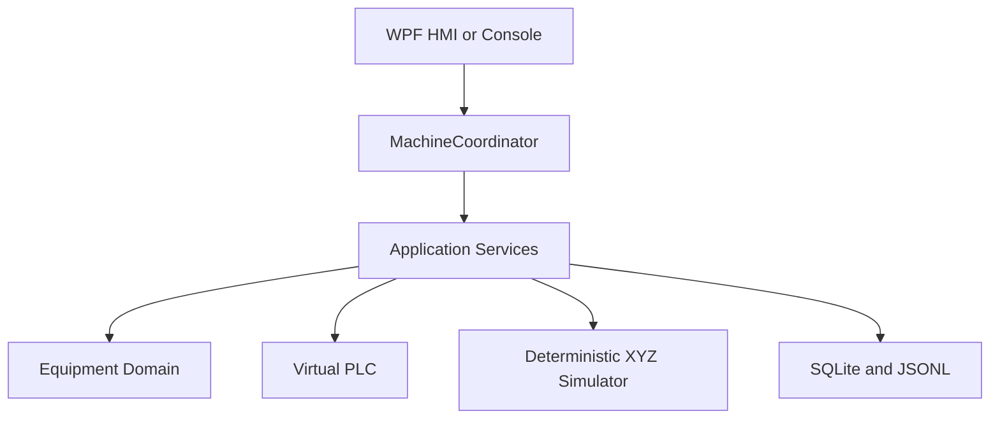
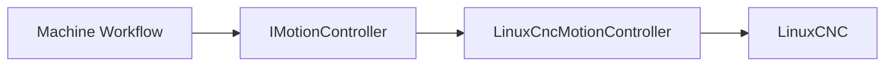

# Virtual Multi-Axis Motion Control Platform

<!-- DOC-NAV:START -->

[Home](README.md) · [Documentation](docs/README.md) · [Getting Started](docs/GETTING_STARTED.md) · [Architecture](docs/ARCHITECTURE.md) · [Testing](docs/TEST_STRATEGY.md) · [Implementation](docs/IMPLEMENTATION_GUIDE.md)

<!-- DOC-NAV:END -->

[](https://github.com/parthoece/multiaxis-motion-sim/actions/workflows/ci.yml)
[](https://github.com/parthoece/multiaxis-motion-sim/actions/workflows/windows-hmi.yml)
[](https://github.com/parthoece/multiaxis-motion-sim/actions/workflows/codeql.yml)
[](global.json)
[](configs/linuxcnc/)
[](LICENSE)
[](#scope-boundary)

> **Test industrial machine-control software before the physical machine exists.**

A software-in-the-loop virtual commissioning platform for deterministic XYZ motion, machine-state control, fault injection, cancellation, recovery, diagnostics, and operator-interface testing.

Built with **C#/.NET, WPF, SQLite, xUnit, and an independent LinuxCNC simulation profile**.

---

## Explore the project

| I want to… | Start here |
| --- | --- |
| Run a complete inspection cycle | [Run the normal scenario](#run-the-normal-scenario) |
| Reproduce a machine fault | [Inject a fault](#inject-a-fault) |
| Test operator Stop behavior | [Test operator-stop](#test-operator-stop) |
| Launch the Windows interface | [Run the WPF HMI](#run-the-wpf-hmi) |
| Understand the architecture | [See how it works](#how-it-works) |
| Explore the LinuxCNC profile | [Open the LinuxCNC section](#linuxcnc-simulation-profile) |
| Review recovery behavior | [Open the recovery policy](#recovery-policy) |
| Run the automated tests | [Go to testing](#testing-and-verification) |

---

## The problem

Industrial machine-control software is often validated only after the mechanical structure, electrical system, controller, sensors, PLC signals, and operator station have been assembled.

That creates several problems:

- software defects become mixed with wiring, sensor, controller, and mechanical failures;
- access to the machine is limited and shared across engineering teams;
- every software correction may require another commissioning session;
- failures are discovered late, when they are more expensive to correct;
- abnormal conditions may be disruptive or unsafe to reproduce repeatedly.

Typical examples include a probe that does not trigger, incomplete homing, E-stop activation, communication loss, missing process permissives, operator cancellation, and movement approaching a configured software limit.

## The solution

This project provides a deterministic virtual machine that allows equipment-software behavior to be tested before physical hardware is available.

It combines:

- a C#/.NET equipment-control application;
- a deterministic virtual Cartesian XYZ machine;
- simulated PLC permissives and process signals;
- versioned inspection recipes;
- repeatable fault injection;
- asynchronous cancellation and Stop handling;
- explicit alarm, reset, and recovery policies;
- SQLite operational history;
- JSON Lines diagnostic events;
- a Windows WPF operator interface;
- an independent LinuxCNC simulation profile.

The objective is not simply to animate three axes. It is to verify that the complete equipment workflow remains **controlled, diagnosable, and recoverable** during normal and abnormal operation.

---

## Try it

### Requirements

- .NET SDK `10.0.302`, or a compatible SDK selected through `global.json`
- Git
- Windows 10 or 11 for the WPF HMI
- Python 3.10 or later for optional repository checks
- LinuxCNC only for the independent LinuxCNC profile

### Clone the repository

```bash
git clone https://github.com/parthoece/multiaxis-motion-sim.git
cd multiaxis-motion-sim
```

### Run the normal scenario

```bash
dotnet restore
dotnet run --project src/MotionControl.OperatorConsole -- normal
```

Expected machine-state sequence:

```text
OFF
→ INITIALIZING
→ NOT_HOMED
→ HOMING
→ READY
→ AUTOMATIC
→ READY
```

During the cycle, the virtual machine:

1. verifies startup permissives;
2. homes Z, X, and Y;
3. loads a five-point inspection recipe;
4. moves above each inspection point;
5. probes the virtual surface;
6. evaluates tolerances;
7. stores the completed cycle and measurements.

Console operational data is written under `.runtime/`.

---

## Pick a scenario

Each scenario is deterministic. Repeating the same scenario should produce the same state transitions, alarm, recovery target, and diagnostic evidence.

| Scenario | Command | What to observe |
| --- | --- | --- |
| Successful inspection | `normal` | Five measurements and a completed cycle |
| Operator Stop | `operator-stop` | Active-operation cancellation and deliberate recovery |
| Probe timeout | `probe-timeout` | Preserved primary alarm and required rehoming |
| Missing part | `part-missing` | Cycle permissive rejection |
| E-stop activation | `estop` | Faulted state and invalidated homing |
| PLC communication loss | `plc-loss` | Communication-fault handling |
| Out of tolerance | `out-of-tolerance` | Completed inspection with a failed process result |

Run any scenario with:

```bash
dotnet run --project src/MotionControl.OperatorConsole -- <scenario>
```

For example:

```bash
dotnet run --project src/MotionControl.OperatorConsole -- probe-timeout
```

> An out-of-tolerance part is a completed process result, not a machine-control fault.

---

## Inject a fault

A failure should be reproducible before it becomes a regression test.

```mermaid
flowchart LR
    A[Inject timeout]
    B[Probe fails]
    C[Cancel motion<br/>Enter Faulted]
    D[Preserve alarm<br/>Reset and rehome]

    A --> B --> C --> D
<details> <summary><strong>View the complete fault sequence</strong></summary>
Enable probe-timeout injection.
Start the inspection.
The simulated probe does not trigger.
Active motion is cancelled.
The machine enters Faulted.
ProbeTimeout remains the primary alarm.
Reset returns the machine to NotHomed.
Rehoming is required before another automatic cycle.
</details> ```

---

## Test operator Stop

```bash
dotnet run --project src/MotionControl.OperatorConsole -- operator-stop
```

Expected behavior:

```text
Automatic motion
→ operator presses Stop
→ active workflow is cancelled
→ motion completion is confirmed
→ OperationCancelled alarm is recorded
→ machine enters Faulted
→ operator resets
→ machine returns to Ready
```

The scenario exits successfully only when cancellation and recovery behavior are verified.

---

## How it works

### Current implementation



The presentation layer sends commands through `MachineCoordinator`. Application services coordinate machine state, motion, simulated PLC signals, persistence, diagnostics, cancellation, and recovery.

### Planned LinuxCNC integration



The equipment workflow depends on `IMotionController`, not on a specific motion platform. This keeps controller-specific communication outside the domain and application rules.

<details>
<summary><strong>Explore the application responsibilities</strong></summary>

| Component | Responsibility |
| --- | --- |
| Lifecycle service | Initialization, homing, reset, and recovery |
| Inspection service | Recipe execution, probing, measurements, and tolerance evaluation |
| Stop service | Active-operation cancellation and motion completion confirmation |
| Status service | Continuous machine, axis, signal, alarm, and measurement status |
| Command gate | Prevents conflicting machine commands |
| Fault context | Preserves the primary fault and required recovery target |
| Persistence | Stores transitions, alarms, cycles, and measurements |
| Event log | Writes append-friendly JSON Lines diagnostic events |

See [Architecture](docs/ARCHITECTURE.md) for the complete design.

</details>

---

## Run the WPF HMI

Run the Windows operator interface:

```powershell
dotnet run --project src/MotionControl.Hmi.Wpf
```

The HMI provides:

- state-aware command availability;
- continuous XYZ position status;
- movement indication;
- permissive and alarm summaries;
- operational-warning status;
- recent inspection measurements;
- deterministic probe-timeout controls.

WPF operational data is stored under the current user’s local application-data directory.

<details>
<summary><strong>Suggested HMI demonstration</strong></summary>

1. Select **Initialize**.
2. Select **Home All**.
3. Confirm the machine reaches `Ready`.
4. Run a normal inspection.
5. Review the five measurements.
6. Enable probe-timeout injection.
7. Start another inspection.
8. Observe cancellation and the preserved alarm.
9. Reset the machine.
10. Rehome and return to `Ready`.

</details>

<!--
Optional: add a real screenshot or short GIF when available.

<p align="center">
  
</p>
-->

---

## LinuxCNC simulation profile

Run the independent LinuxCNC profile on a LinuxCNC system:

```bash
linuxcnc configs/linuxcnc/xyz-3axis/machine.ini
```

The profile includes:

- three simulated Cartesian axes;
- homing configuration;
- configured software limits;
- HAL configuration;
- coordinated-motion programs;
- probing G-code.

The LinuxCNC profile is currently independent of the .NET application.

A future `LinuxCncMotionController` adapter is planned to implement `IMotionController` without changing equipment-domain rules.

<details>
<summary><strong>Why keep LinuxCNC behind an adapter?</strong></summary>

The application should not contain controller-specific rules.

The adapter boundary allows the same machine workflow to operate with:

- the deterministic in-process simulator;
- LinuxCNC;
- a future physical motion controller.

Controller communication can change without rewriting machine states, recipes, alarm policy, or recovery behavior.

</details>

---

## Diagnostics and operational evidence

The platform records two complementary forms of evidence:

| Store | Purpose |
| --- | --- |
| SQLite | Transactional machine transitions, alarms, cycles, and measurements |
| JSON Lines | Append-friendly diagnostic events for troubleshooting and inspection |

This supports both structured operational history and portable event-level diagnostics.

<details>
<summary><strong>What should be diagnosable after a failure?</strong></summary>

A repeatable fault should leave enough evidence to answer:

- Which command was active?
- Which permissive or signal changed?
- What was the primary alarm?
- Was active motion cancelled?
- Which machine state followed?
- What recovery target was selected?
- Was rehoming required?
- Which secondary warnings occurred?

</details>

---

## Testing and verification

Run the complete .NET test suite:

```bash
dotnet test
```

Run individual test projects:

```bash
dotnet test tests/MotionControl.Domain.Tests
dotnet test tests/MotionControl.Application.Tests
dotnet test tests/MotionControl.IntegrationTests
```

Run repository checks:

```bash
python scripts/check_architecture.py
python scripts/check_docs.py
```

On a compatible shell:

```bash
./scripts/check.sh
```

Verification coverage includes:

- domain rules and machine-state transitions;
- initialization and homing;
- inspection workflows;
- cancellation and Stop behavior;
- primary-fault preservation and recovery;
- continuous status reporting;
- SQLite persistence;
- JSON Lines diagnostics;
- architecture dependency rules;
- documentation integrity.

The workflow badges at the top of this README show the latest authoritative CI, Windows HMI, and CodeQL status.

---

## Recovery policy

Reset does not automatically restart motion.

<details>
<summary><strong>View recovery targets</strong></summary>

| Fault condition | Recovery target |
| --- | --- |
| Missing part | `Ready` |
| Air pressure unavailable | `Ready` |
| Operator cancellation | `Ready` in the deterministic simulator |
| Probe timeout | `NotHomed` |
| Homing failure | `NotHomed` |
| Software-limit violation | `NotHomed` |
| E-stop activation | `NotHomed` |
| Motion controller unavailable | `Off` |
| Unexpected startup failure | `Off` |

A future physical controller adapter may apply stricter recovery requirements.

</details>

---

## Repository map

<details>
<summary><strong>Open repository structure</strong></summary>

```text
multiaxis-motion-sim/
├── src/
│   ├── MotionControl.Domain/
│   ├── MotionControl.Application/
│   ├── MotionControl.Simulation/
│   ├── MotionControl.Persistence/
│   ├── MotionControl.OperatorConsole/
│   └── MotionControl.Hmi.Wpf/
├── tests/
│   ├── MotionControl.Domain.Tests/
│   ├── MotionControl.Application.Tests/
│   └── MotionControl.IntegrationTests/
├── configs/linuxcnc/
├── gcode/
├── docs/
├── scripts/
└── .github/
```

</details>

---

## Project direction

Current development priorities include:

- maintaining passing Linux and Windows workflows;
- completing the WPF manual test matrix;
- verifying the LinuxCNC profile in its target environment;
- adding alarm-history and recipe-management interfaces;
- implementing the .NET-to-LinuxCNC adapter;
- adding shared motion-controller contract tests.

See the [Development Plan](docs/DEVELOPMENT_PLAN.md) for the detailed roadmap.

---

## Scope boundary

This project validates software behavior, including:

- equipment architecture;
- machine-state transitions;
- coordinated-motion commands;
- homing order;
- software limits;
- simulated PLC handshakes;
- recipes and inspection logic;
- alarms and recovery;
- persistence;
- command concurrency;
- cancellation;
- deterministic failure scenarios.

It does **not** validate:

- physical positioning accuracy or repeatability;
- backlash, stiffness, vibration, or thermal behavior;
- motor, drive, or power-supply sizing;
- electrical-noise immunity;
- real sensor performance;
- physical collision dynamics;
- emergency-stop hardware performance;
- functional-safety integrity;
- machinery-safety compliance.

> This is a simulation-only project. Physical performance and safety claims require separate hardware validation.

---

## Continue exploring

| Topic | Document |
| --- | --- |
| Install and run | [Getting Started](docs/GETTING_STARTED.md) |
| Understand the design | [Architecture](docs/ARCHITECTURE.md) |
| Follow the implementation | [Implementation Guide](docs/IMPLEMENTATION_GUIDE.md) |
| Review verification coverage | [Test Strategy](docs/TEST_STRATEGY.md) |
| Prepare a portfolio demonstration | [Portfolio Review](docs/PORTFOLIO_REVIEW.md) |
| Prepare for technical discussion | [Interview Preparation](docs/INTERVIEW_PREP.md) |
| Browse all documentation | [Documentation Index](docs/README.md) |

## License

Released under the [MIT License](LICENSE).

---

<!-- DOC-FOOTER:START -->

[Documentation index](docs/README.md) · [Back to top](#virtual-multi-axis-motion-control-platform)

<!-- DOC-FOOTER:END -->
