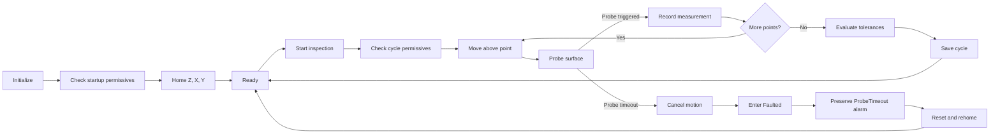
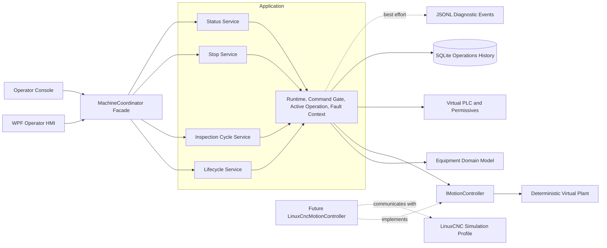

# Virtual Multi-Axis Motion Control Platform

<!-- DOC-NAV:START -->

[Home](README.md) · [Docs](docs/README.md) · [Start](docs/GETTING_STARTED.md) · [Implement](docs/IMPLEMENTATION_GUIDE.md) · [Architecture](docs/ARCHITECTURE.md) · [Test](docs/TEST_STRATEGY.md) · [Interview](docs/INTERVIEW_PREP.md)

<!-- DOC-NAV:END -->

[](.github/workflows/ci.yml)
[](.github/workflows/windows-hmi.yml)
[](.github/workflows/codeql.yml)
[](LICENSE)
[](global.json)
[](#scope-boundary)

An open-source, software-in-the-loop virtual commissioning platform for verifying industrial machine workflows before physical equipment is available.

The first machine profile is a Cartesian XYZ inspection system controlled by a C#/.NET equipment application.

## The problem

Machine-control software is often validated only after the mechanical structure, electrical system, motion controller, sensors, and operator station have been assembled.

At that stage:

* software defects become mixed with wiring, sensor, controller, and mechanical failures;
* machine access is limited and shared across engineering teams;
* every software correction may require another commissioning session;
* failures are discovered late, when they are more expensive to correct;
* abnormal conditions may be disruptive or unsafe to reproduce repeatedly.

Examples include:

* a probe that fails to trigger;
* homing that does not complete;
* an E-stop or guard input becoming active;
* a part-present signal disappearing;
* communication with the PLC or motion controller being lost;
* an operator pressing Stop during motion;
* movement approaching a configured software limit.

> How can an equipment-software team verify motion, permissives, machine states, alarms, cancellation, and recovery before the physical machine is assembled?

## The solution

This project combines:

* a C#/.NET equipment-control application;
* a deterministic virtual XYZ machine;
* PLC-style safety and process signals;
* versioned inspection recipes;
* repeatable fault injection;
* SQLite operational history;
* JSON Lines diagnostic events;
* a Windows WPF operator interface;
* an independent LinuxCNC simulation profile.

The goal is not merely to simulate axes moving.

The goal is to verify that the complete equipment workflow remains controlled, diagnosable, and recoverable during both normal and abnormal operation.

## Example workflow



The same deterministic workflow supports both successful inspection and repeatable verification of abnormal behavior.

## Why deterministic simulation matters

A failure should be reproducible before it can become a reliable regression test.

```text
Inject probe timeout
→ run inspection
→ probe does not trigger
→ active motion is cancelled
→ machine enters Faulted
→ ProbeTimeout remains the primary alarm
→ reset requires rehoming
```

Repeating the same scenario should produce the same state transitions, alarm, recovery requirement, and diagnostic evidence.

## Current maturity

> **Implementation status:** The simulation architecture and source implementation are present. Documentation, repository structure, file formats, and architecture boundaries have been validated locally.
>
> **Verification pending:** Authoritative .NET restore, compilation, automated test execution, Windows HMI execution, and LinuxCNC runtime verification must still pass in GitHub Actions or their target environments.

The project is simulation-only. Physical performance and machinery-safety claims require separate hardware validation.

## System boundary



## Implemented capabilities

| Area                       | Capabilities                                                                                                    |
| -------------------------- | --------------------------------------------------------------------------------------------------------------- |
| Machine workflow           | Initialization, homing, Ready state, automatic inspection, faults, reset, and recovery                          |
| Motion simulation          | Deterministic XYZ travel, observable intermediate positions, software limits, Z-X-Y homing, and virtual probing |
| Safety and process signals | E-stop, guard door, part present, air pressure, PLC communication, and stack-light outputs                      |
| Concurrency                | Exclusive command execution, operation-scoped cancellation, operator Stop, and completion confirmation          |
| Inspection                 | Versioned recipes, five-point probing, tolerance evaluation, and pass/fail cycle reports                        |
| Fault handling             | Deterministic fault injection, primary-fault preservation, acknowledgement, and explicit recovery targets       |
| Diagnostics                | SQLite transitions, alarms, cycles, measurements, JSONL events, and secondary operational warnings              |
| Presentation               | Cross-platform console and state-aware Windows WPF HMI                                                          |
| Quality                    | Domain, workflow, cancellation, status, persistence, diagnostics, architecture, and documentation checks        |
| Motion profile             | Independent LinuxCNC XYZ simulation configuration, HAL, limits, homing, and G-code                              |

## Recovery policy

Fault recovery does not automatically restart motion.

| Fault example                 | Recovery target                        |
| ----------------------------- | -------------------------------------- |
| Missing part                  | `Ready`                                |
| Air pressure unavailable      | `Ready`                                |
| Operator cancellation         | `Ready` in the deterministic simulator |
| Probe timeout                 | `NotHomed`                             |
| Homing failure                | `NotHomed`                             |
| Software-limit violation      | `NotHomed`                             |
| E-stop activation             | `NotHomed`                             |
| Motion controller unavailable | `Off`                                  |
| Unexpected startup failure    | `Off`                                  |

A future physical controller adapter may apply stricter recovery rules.

## Technology choices

| Technology                | Engineering purpose                                                                |
| ------------------------- | ---------------------------------------------------------------------------------- |
| .NET 10 and C#            | Domain logic, asynchronous workflows, adapters, tests, and operator software       |
| WPF                       | Windows-based equipment HMI with binding and asynchronous commands                 |
| LinuxCNC, HAL, and G-code | Independent motion simulation profile for homing, limits, and coordinated movement |
| SQLite                    | Transactional local operational history for one simulated machine                  |
| JSON Lines                | Portable, append-friendly diagnostic events                                        |
| xUnit                     | Domain, workflow, persistence, and reliability verification                        |
| GitHub Actions            | Repeatable Linux and Windows build-and-test workflows                              |
| CodeQL                    | Automated source-code security analysis                                            |
| Python standard library   | Documentation and architecture validation                                          |

Docker, Kubernetes, MQTT, PostgreSQL, Grafana, ROS 2, and microservices are intentionally excluded from the core release.

They do not solve the current single-machine virtual-commissioning problem.

## Quick start

### Requirements

* .NET SDK `10.0.302` or a compatible SDK selected through `global.json`
* Git
* Python 3.10 or later for repository checks
* Windows 10 or 11 for the WPF HMI
* A LinuxCNC environment only for the independent LinuxCNC profile

### Clone the repository

```bash
git clone https://github.com/parthoece/multiaxis-motion-sim.git
cd multiaxis-motion-sim
```

Replace `parthoece` with the GitHub username or organization before publishing.

### Run the normal console simulation

```bash
dotnet restore
dotnet run --project src/MotionControl.OperatorConsole -- normal
```

Expected machine-state flow:

```text
OFF
→ INITIALIZING
→ NOT_HOMED
→ HOMING
→ READY
→ AUTOMATIC
→ READY
```

Operational data is written under `.runtime/`.

### Run the operator-stop scenario

```bash
dotnet run --project src/MotionControl.OperatorConsole -- operator-stop
```

Expected behavior:

```text
Automatic motion
→ operator Stop
→ active workflow cancelled
→ OperationCancelled alarm
→ Faulted
→ deliberate reset
→ Ready
```

The scenario returns zero only when cancellation and recovery are verified successfully.

### Run abnormal scenarios

```bash
dotnet run --project src/MotionControl.OperatorConsole -- probe-timeout
dotnet run --project src/MotionControl.OperatorConsole -- part-missing
dotnet run --project src/MotionControl.OperatorConsole -- estop
dotnet run --project src/MotionControl.OperatorConsole -- plc-loss
dotnet run --project src/MotionControl.OperatorConsole -- out-of-tolerance
```

Unrecovered fault scenarios such as `probe-timeout` intentionally return a non-zero process exit code.

An out-of-tolerance part is a completed process result rather than a machine-control fault.

### Run tests and repository checks

```bash
dotnet test tests/MotionControl.Domain.Tests
dotnet test tests/MotionControl.Application.Tests
dotnet test tests/MotionControl.IntegrationTests

python scripts/check_architecture.py
python scripts/check_docs.py
```

Run the complete repository check:

```bash
./scripts/check.sh
```


### Run the Windows WPF HMI

```powershell
dotnet run --project src/MotionControl.Hmi.Wpf
```

The HMI provides:

* state-aware command availability;
* continuous XYZ status;
* movement indication;
* safety-permissive summary;
* active alarm display;
* operational-warning count;
* latest inspection measurements;
* deterministic probe-timeout controls.

### Run the LinuxCNC simulation profile

On a LinuxCNC system:

```bash
linuxcnc configs/linuxcnc/xyz-3axis/machine.ini
```

The LinuxCNC profile is currently independent of the .NET application.

The future `LinuxCncMotionController` adapter will implement `IMotionController` without changing the equipment-domain rules.

## Recommended portfolio demonstration

A concise demonstration should show:

1. Initialization and Z-X-Y homing
2. A successful five-point inspection
3. Persisted measurements and cycle result
4. Operator Stop during active motion
5. Probe-timeout fault injection
6. Primary alarm preservation
7. Controlled reset and rehoming
8. The adapter boundary planned for LinuxCNC

## Repository structure

```text
multiaxis-motion-sim/
├── src/
│   ├── MotionControl.Domain/          # States, recovery policy, recipes, alarms
│   ├── MotionControl.Application/
│   │   ├── Common/                    # Runtime, gate, active operation, fault context
│   │   ├── Lifecycle/                 # Initialize, home, reset
│   │   ├── Inspection/                # Automatic inspection cycle
│   │   ├── Status/                    # Snapshot and continuous status
│   │   └── Stop/                      # Operator stop and confirmation
│   ├── MotionControl.Simulation/      # Deterministic motion and virtual PLC
│   ├── MotionControl.Persistence/     # SQLite and JSONL diagnostics
│   ├── MotionControl.OperatorConsole/ # Cross-platform executable scenarios
│   └── MotionControl.Hmi.Wpf/         # Windows equipment HMI
├── tests/
│   ├── MotionControl.Domain.Tests/
│   ├── MotionControl.Application.Tests/
│   ├── MotionControl.IntegrationTests/
│   └── manual/
├── configs/linuxcnc/                  # Independent LinuxCNC profiles
├── gcode/                             # Motion and probing programs
├── docs/                              # Engineering and maintenance documentation
├── scripts/                           # Repository and architecture checks
└── .github/                           # CI, security, issues, and contribution workflow
```

## Verification status

| Verification area                              | Status                                 |
| ---------------------------------------------- | -------------------------------------- |
| Documentation navigation and local links       | Passed locally                         |
| Architecture dependency rules                  | Passed locally                         |
| Shell, JSON, YAML, XML, and XAML format checks | Passed locally                         |
| Repository ZIP integrity                       | Passed locally                         |
| .NET restore and compilation                   | Pending target environment             |
| Automated .NET tests                           | Test source present; execution pending |
| Windows WPF build and runtime                  | Pending Windows workflow               |
| LinuxCNC profile execution                     | Manual verification pending            |
| .NET-to-LinuxCNC integration                   | Planned                                |
| Physical machine validation                    | Out of scope                           |

## Project roadmap

### Next release

* Pass public Linux and Windows CI
* Record normal, Stop, fault, and recovery demonstrations
* Complete the WPF manual test matrix
* Add alarm-history presentation
* Add recipe selection and details
* Add an I/O monitor
* Add diagnostic export

### Later milestones

* Add explicit SQLite migrations
* Verify the LinuxCNC profile
* Implement `LinuxCncMotionController`
* Add shared motion-adapter contract tests
* Introduce one advanced rotary or gantry profile

See the [development plan](docs/DEVELOPMENT_PLAN.md) for the complete implementation sequence.

## Scope boundary

The project validates software behavior:

* equipment architecture;
* machine-state transitions;
* coordinated-motion commands;
* homing order;
* software limits;
* virtual PLC handshakes;
* recipes and inspection logic;
* alarms and recovery;
* persistence;
* command concurrency;
* cancellation;
* deterministic failure scenarios.

The project does **not** validate:

* physical positioning accuracy or repeatability;
* backlash, stiffness, vibration, or thermal behavior;
* motor, drive, or power-supply sizing;
* electrical-noise immunity;
* real sensor performance;
* physical collision dynamics;
* hardware emergency-stop performance;
* functional-safety integrity;
* machinery-safety compliance.

Every physical-performance claim remains **physical validation required**.

## Documentation

Start with the [documentation index](docs/README.md).

Recommended paths:

* [Getting Started](docs/GETTING_STARTED.md)
* [Architecture](docs/ARCHITECTURE.md)
* [Implementation Guide](docs/IMPLEMENTATION_GUIDE.md)
* [Test Strategy](docs/TEST_STRATEGY.md)
* [Interview Preparation](docs/INTERVIEW_PREP.md)
* [Portfolio Review](docs/PORTFOLIO_REVIEW.md)

The documentation index contains the complete operator, developer, configuration, troubleshooting, requirements, traceability, LinuxCNC, release, and maintenance guides.

## Open-source project

The repository uses the MIT License and includes:

* contribution guidelines;
* a code of conduct;
* governance and support policies;
* a security policy;
* citation metadata;
* machine-readable licensing information;
* issue forms and a pull-request template;
* ownership configuration;
* automated dependency updates;
* CI and security workflows;
* release and maintainer guidance.

Before publishing, replace every `parthoece` placeholder with the GitHub username or organization:

```bash
python scripts/replace_owner.py YOUR_GITHUB_USERNAME
```

## License

Released under the [MIT License](LICENSE).

---

<!-- DOC-FOOTER:START -->

[Documentation index](docs/README.md) · [Back to top](#virtual-multi-axis-motion-control-platform)

<!-- DOC-FOOTER:END -->
