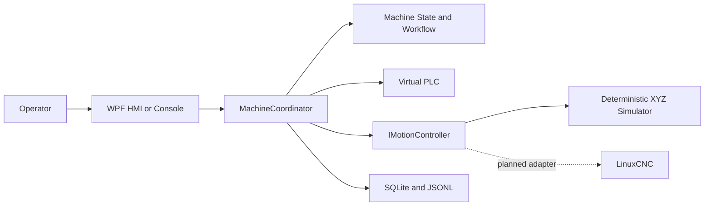

# Virtual Multi-Axis Motion Control Platform

[](https://github.com/parthoece/multiaxis-motion-sim/actions/workflows/ci.yml)
[](https://github.com/parthoece/multiaxis-motion-sim/actions/workflows/windows-hmi.yml)
[](https://github.com/parthoece/multiaxis-motion-sim/actions/workflows/codeql.yml)
[](global.json)
[](configs/linuxcnc/)
[](LICENSE)
[](#scope-boundary)

> **Test industrial machine-control software before the physical machine exists.**

A software-in-the-loop virtual commissioning platform for deterministic XYZ motion, machine-state control, fault injection, cancellation, recovery, diagnostics, and operator-interface testing.

Built with **C#/.NET, WPF, SQLite, xUnit, and LinuxCNC**.

---

## See it in action

<!-- Replace this placeholder with an animated GIF or screenshot. -->

<p align="center">
  
</p>

> Add a short 15–30 second GIF showing:
>
> `Initialize → Home → Run inspection → Inject probe timeout → Reset`

No physical controller, PLC, probe, or machine frame is required.

---

## Choose what to explore

| I want to…                         | Start here                                          |
| ---------------------------------- | --------------------------------------------------- |
| Run a successful inspection        | [Normal cycle](#run-a-normal-inspection)            |
| Trigger a repeatable machine fault | [Fault injection](#inject-a-fault)                  |
| Test operator Stop behavior        | [Operator cancellation](#test-operator-stop)        |
| Launch the Windows interface       | [WPF HMI](#windows-operator-hmi)                    |
| Explore the design                 | [Architecture](#how-it-works)                       |
| Run the LinuxCNC profile           | [LinuxCNC simulation](#linuxcnc-simulation-profile) |
| Review the test strategy           | [Testing](#testing-and-verification)                |
| Understand project limits          | [Scope boundary](#scope-boundary)                   |

---

## Try it

### Clone the repository

```bash
git clone https://github.com/parthoece/multiaxis-motion-sim.git
cd multiaxis-motion-sim
```

### Run a normal inspection

```bash
dotnet run --project src/MotionControl.OperatorConsole -- normal
```

Expected machine-state sequence:

```text
OFF
→ INITIALIZING
→ NOT_HOMED
→ HOMING
→ READY
→ AUTOMATIC
→ READY
```

The simulated machine:

1. verifies startup permissives;
2. homes the Z, X, and Y axes;
3. loads a five-point inspection recipe;
4. moves above each inspection point;
5. probes the virtual surface;
6. evaluates tolerances;
7. stores the cycle and measurements.

---

## Pick a scenario

Each scenario is deterministic. Running the same scenario should produce the same state transitions, alarm, recovery target, and diagnostic evidence.

| Scenario               | Command            | What to observe                                     |
| ---------------------- | ------------------ | --------------------------------------------------- |
| Successful inspection  | `normal`           | Five measurements and a completed cycle             |
| Operator Stop          | `operator-stop`    | Active motion cancellation and deliberate recovery  |
| Probe timeout          | `probe-timeout`    | Primary alarm preservation and rehoming requirement |
| Missing part           | `part-missing`     | Cycle permissive rejection                          |
| E-stop activation      | `estop`            | Faulted state and invalidated homing                |
| PLC communication loss | `plc-loss`         | Communication fault handling                        |
| Out of tolerance       | `out-of-tolerance` | Completed inspection with a failed process result   |

Run any scenario:

```bash
dotnet run --project src/MotionControl.OperatorConsole -- <scenario>
```

For example:

```bash
dotnet run --project src/MotionControl.OperatorConsole -- probe-timeout
```

---

## Inject a fault

A failure should be reproducible before it becomes a regression test.

```mermaid
flowchart LR
    A[Inject probe timeout] --> B[Start inspection]
    B --> C[Move above point]
    C --> D[Begin probing]
    D --> E[Probe does not trigger]
    E --> F[Cancel motion]
    F --> G[Enter Faulted]
    G --> H[Preserve ProbeTimeout]
    H --> I[Reset]
    I --> J[Rehome]
    J --> K[Ready]
```



<details>
<summary><strong>Why preserve the primary alarm?</strong></summary>

A secondary cancellation or cleanup event should not replace the original machine fault.

For a probe timeout:

* `ProbeTimeout` remains the primary alarm;
* active movement is cancelled;
* the machine enters `Faulted`;
* reset returns the machine to `NotHomed`;
* homing must complete before another automatic cycle.

This makes the failure diagnosable and prevents recovery logic from hiding its cause.

</details>

---

## Test operator Stop

```bash
dotnet run --project src/MotionControl.OperatorConsole -- operator-stop
```

Expected behavior:

```text
Automatic motion
→ operator presses Stop
→ active workflow is cancelled
→ motion completion is confirmed
→ OperationCancelled alarm is recorded
→ machine enters Faulted
→ operator resets
→ machine returns to Ready
```

The scenario exits successfully only when cancellation and recovery behavior are verified.

---

## The problem

Industrial machine-control software is often validated only after the mechanical structure, electrical system, motion controller, sensors, PLC, and operator station have been assembled.

At that stage:

* software defects become mixed with wiring and mechanical problems;
* access to the machine is limited;
* failures are expensive to reproduce;
* every software correction may require another commissioning session;
* abnormal conditions may be disruptive or unsafe to test repeatedly.

Examples include probe timeouts, homing failures, communication loss, missing permissives, E-stop activation, operator cancellation, and software-limit violations.

---

## The solution

This project provides a deterministic virtual machine that allows equipment-software behavior to be tested before hardware is available.

It combines:

* a C#/.NET equipment-control application;
* a deterministic virtual XYZ machine;
* simulated PLC permissives and process signals;
* versioned inspection recipes;
* repeatable fault injection;
* asynchronous cancellation and Stop handling;
* explicit alarm and recovery policies;
* SQLite operational history;
* JSON Lines diagnostic events;
* a Windows WPF operator interface;
* an independent LinuxCNC simulation profile.

The objective is not simply to animate three axes.

The objective is to verify that the complete equipment workflow remains controlled, diagnosable, and recoverable during both normal and abnormal operation.

---

## How it works



The application depends on the `IMotionController` abstraction rather than a specific motion platform.

The deterministic simulator is the current .NET motion implementation. The LinuxCNC profile is independent and provides a future integration target.

<details>
<summary><strong>Explore the application responsibilities</strong></summary>

| Component          | Responsibility                                                    |
| ------------------ | ----------------------------------------------------------------- |
| Lifecycle service  | Initialization, homing, reset, and recovery                       |
| Inspection service | Recipe execution, probing, measurements, and tolerance evaluation |
| Stop service       | Active-operation cancellation and motion completion confirmation  |
| Status service     | Continuous machine, axis, signal, alarm, and measurement status   |
| Command gate       | Prevents conflicting machine commands                             |
| Fault context      | Preserves the primary fault and required recovery target          |
| Persistence        | Stores states, alarms, cycles, and measurements                   |
| Event log          | Writes append-friendly JSON Lines diagnostic events               |

See [Architecture](docs/ARCHITECTURE.md) for the complete design.

</details>

---

## Windows operator HMI

Run on Windows:

```powershell
dotnet run --project src/MotionControl.Hmi.Wpf
```

The HMI provides:

* state-aware command buttons;
* continuous XYZ position status;
* movement indication;
* permissive status;
* active alarm display;
* warning count;
* latest inspection measurements;
* deterministic probe-timeout controls.

Operational data is stored under the current user’s local application-data directory.

<details>
<summary><strong>Suggested HMI demonstration</strong></summary>

1. Select **Initialize**.
2. Select **Home All**.
3. Confirm the machine reaches `Ready`.
4. Run a normal inspection.
5. Review the five measurements.
6. Enable probe-timeout injection.
7. Start another inspection.
8. Observe motion cancellation and the preserved alarm.
9. Reset the machine.
10. Rehome and return to `Ready`.

</details>

---

## LinuxCNC simulation profile

Run on a LinuxCNC system:

```bash
linuxcnc configs/linuxcnc/xyz-3axis/machine.ini
```

The profile includes:

* three Cartesian axes;
* simulated homing;
* configured travel limits;
* HAL configuration;
* coordinated-motion programs;
* probing G-code.

The LinuxCNC profile is currently independent of the .NET application.

A future `LinuxCncMotionController` adapter is planned to implement `IMotionController` without changing the equipment-domain rules.

<details>
<summary><strong>Why keep LinuxCNC behind an adapter?</strong></summary>

The application should not contain controller-specific rules.

The adapter boundary allows the same equipment workflow to operate with:

* the deterministic in-process simulator;
* LinuxCNC;
* a future physical motion controller.

Controller communication can change without rewriting machine states, recipes, alarm policy, or recovery behavior.

</details>

---

## Testing and verification

Run the complete .NET test suite:

```bash
dotnet test
```

Run individual test projects:

```bash
dotnet test tests/MotionControl.Domain.Tests
dotnet test tests/MotionControl.Application.Tests
dotnet test tests/MotionControl.IntegrationTests
```

Run repository checks:

```bash
python scripts/check_architecture.py
python scripts/check_docs.py
```

On a compatible shell:

```bash
./scripts/check.sh
```

Test coverage includes:

* domain rules and state transitions;
* initialization and homing;
* inspection workflows;
* cancellation and Stop behavior;
* fault preservation and recovery;
* status reporting;
* SQLite persistence;
* JSON Lines diagnostics;
* architecture dependency rules;
* documentation integrity.

The workflow badges at the top of this README show the latest authoritative CI status.

---

## Recovery explorer

<details>
<summary><strong>View recovery targets</strong></summary>

Reset does not automatically restart motion.

| Fault condition               | Recovery target                        |
| ----------------------------- | -------------------------------------- |
| Missing part                  | `Ready`                                |
| Air pressure unavailable      | `Ready`                                |
| Operator cancellation         | `Ready` in the deterministic simulator |
| Probe timeout                 | `NotHomed`                             |
| Homing failure                | `NotHomed`                             |
| Software-limit violation      | `NotHomed`                             |
| E-stop activation             | `NotHomed`                             |
| Motion controller unavailable | `Off`                                  |
| Unexpected startup failure    | `Off`                                  |

A future physical controller may apply stricter recovery requirements.

</details>

---

## Repository map

<details>
<summary><strong>Open repository structure</strong></summary>

```text
multiaxis-motion-sim/
├── src/
│   ├── MotionControl.Domain/
│   ├── MotionControl.Application/
│   ├── MotionControl.Simulation/
│   ├── MotionControl.Persistence/
│   ├── MotionControl.OperatorConsole/
│   └── MotionControl.Hmi.Wpf/
├── tests/
│   ├── MotionControl.Domain.Tests/
│   ├── MotionControl.Application.Tests/
│   └── MotionControl.IntegrationTests/
├── configs/linuxcnc/
├── gcode/
├── docs/
├── scripts/
└── .github/
```

</details>

---

## Scope boundary

This repository validates software behavior:

* equipment architecture;
* machine states and transitions;
* coordinated-motion commands;
* homing order;
* software limits;
* simulated PLC handshakes;
* recipes and inspection logic;
* alarms and recovery;
* persistence;
* concurrency and cancellation;
* deterministic failure scenarios.

It does not validate:

* physical positioning accuracy or repeatability;
* backlash, stiffness, vibration, or thermal behavior;
* motors, drives, or power-supply sizing;
* real sensor performance;
* electrical-noise immunity;
* physical collision dynamics;
* emergency-stop hardware performance;
* functional-safety integrity;
* machinery-safety compliance.

> This is a simulation-only project. Physical performance and safety claims require separate hardware validation.

---

## Continue exploring

| Topic                             | Document                                             |
| --------------------------------- | ---------------------------------------------------- |
| Install and run                   | [Getting Started](docs/GETTING_STARTED.md)           |
| Understand the design             | [Architecture](docs/ARCHITECTURE.md)                 |
| Follow the implementation         | [Implementation Guide](docs/IMPLEMENTATION_GUIDE.md) |
| Review verification coverage      | [Test Strategy](docs/TEST_STRATEGY.md)               |
| Prepare a portfolio demonstration | [Portfolio Review](docs/PORTFOLIO_REVIEW.md)         |
| Prepare for technical discussion  | [Interview Preparation](docs/INTERVIEW_PREP.md)      |
| Browse all documentation          | [Documentation Index](docs/README.md)                |

## License

Released under the [MIT License](LICENSE).
