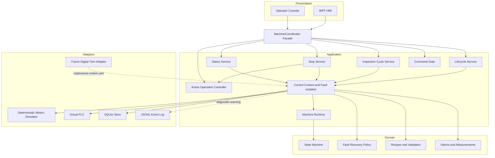
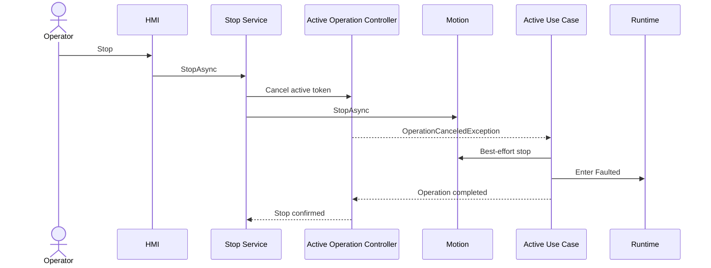

# Architecture

<!-- DOC-NAV:START -->
[Home](../README.md) · [Docs](README.md) · [Start](GETTING_STARTED.md) · [Implement](IMPLEMENTATION_GUIDE.md) · [Architecture](ARCHITECTURE.md) · [Test](TEST_STRATEGY.md) · [Interview](INTERVIEW_PREP.md)
<!-- DOC-NAV:END -->


## Architectural style

The system is a modular monolith using ports and adapters. The core remains local because the current business problem concerns one simulated machine, one operator application, and local operational evidence.



## Dependency direction

- `MotionControl.Domain` depends on no project.
- `MotionControl.Application` depends on Domain.
- Simulation and Persistence depend on Application interfaces and Domain types.
- Console and WPF compose concrete adapters.
- Digital Twin-specific code remains outside Domain and Application rules.

## Application responsibilities

| Component | Responsibility |
|---|---|
| `MachineCoordinator` | Stable facade used by the console and HMI |
| `MachineLifecycleService` | Initialize, home, acknowledge, and recover |
| `InspectionCycleService` | Validate recipe, execute motion, probe, evaluate, and persist |
| `MachineStopService` | Cancel active workflow, command stop, and await confirmation |
| `MachineStatusService` | Produce snapshots and continuous status streams |
| `MachineCommandGate` | Reject overlapping state-changing commands |
| `ActiveOperationController` | Own the linked cancellation token for the active operation |
| `MachineRuntime` | Protect current state, active alarm, and last safety inputs |
| `MachineControlContext` | Coordinate ports, transitions, primary faults, and secondary warnings |

## Cancellation flow



## Fault isolation

The primary equipment fault is installed in memory before any secondary persistence, diagnostic, or PLC-output action.

```text
Detect primary fault
→ Stop motion best effort
→ Enter Faulted internally
→ Create active alarm
→ Persist transition best effort
→ Persist alarm best effort
→ Write diagnostic event best effort
→ Write PLC fault outputs best effort
→ Keep secondary failures as operational warnings
```

This prevents a failed alarm lamp write or event-log sink from replacing the original probe, motion, or permissive fault.

## Persistence policy

- State transitions, alarms, cycles, and measurements are operational records.
- A completed cycle and its measurements use one SQLite transaction.
- JSONL events are diagnostic and best effort.
- Diagnostic sink failure creates an in-memory operational warning rather than stopping an otherwise valid cycle.

## Why a modular monolith

The current system does not require independent service deployment, factory-wide event distribution, or multi-machine concurrent data access. A modular monolith provides explicit boundaries, deterministic tests, local transactions, straightforward debugging, and fewer unrelated failure modes.

---

<!-- DOC-FOOTER:START -->
[← Previous: Requirements](REQUIREMENTS.md) · [Documentation index](README.md) · [Next: Domain Model →](DOMAIN_MODEL.md) · [Back to top](#architecture)
<!-- DOC-FOOTER:END -->
