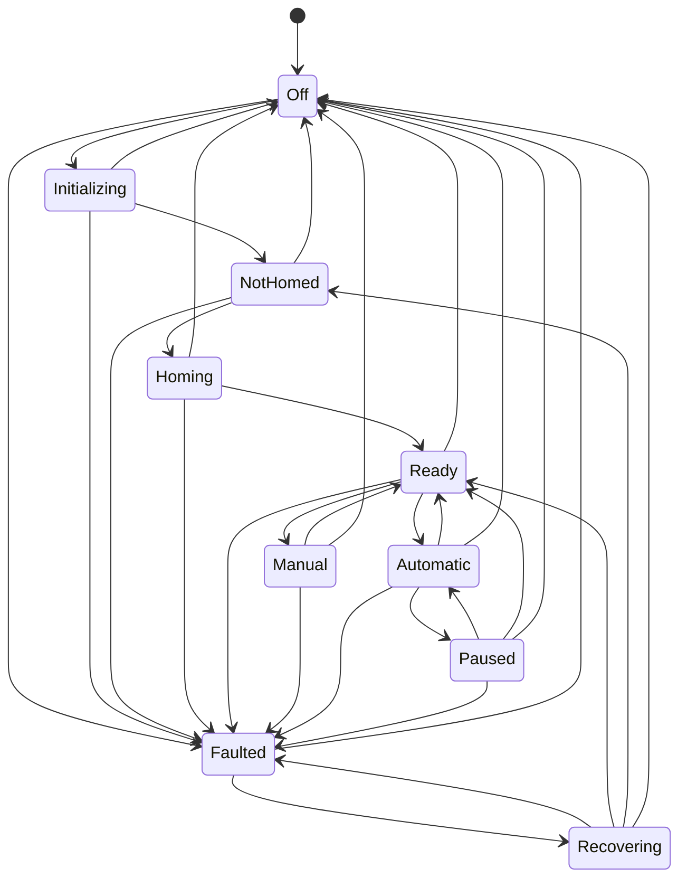

# Machine State Machine

<!-- DOC-NAV:START -->
[Home](../README.md) · [Docs](README.md) · [Start](GETTING_STARTED.md) · [Implement](IMPLEMENTATION_GUIDE.md) · [Architecture](ARCHITECTURE.md) · [Test](TEST_STRATEGY.md) · [Interview](INTERVIEW_PREP.md)
<!-- DOC-NAV:END -->

## Guards

- Initialization requires `Off`.
- Automatic cycle requires `Ready`.
- Homing requires `NotHomed`.
- Startup and homing require E-stop reset, door closed, and air ready.
- Automatic cycle additionally requires part present.
- Recipe validation occurs before entering `Automatic`.
- Only one state-changing command executes at a time.
- Stop bypasses the command gate and cancels the active operation.

## Recovery targets

| Fault example | Recovery target | Reason |
|---|---|---|
| Missing part | `Ready` | Motion did not begin and position remains valid |
| Air not ready | `Ready` | Permissive failure does not invalidate position |
| Invalid recipe | No machine fault | Command is rejected while remaining `Ready` |
| Operator cancellation | `Ready` | Simulated stop preserves known position |
| Probe timeout | `NotHomed` | Conservative position-validity policy |
| Motion limit | `NotHomed` | Position confidence is invalidated |
| Homing failure | `NotHomed` | Referencing must be repeated |
| E-stop | `NotHomed` | Motion interruption requires re-reference |
| Motion controller unavailable | `Off` | Controller must be initialized again |
| Unexpected startup/software failure | `Off` | Full reinitialization is required |

Recovery is deliberate: acknowledge, recheck permissives, transition through `Recovering`, and then enter the policy-selected target state.

---

<!-- DOC-FOOTER:START -->
[← Previous: Domain Model](DOMAIN_MODEL.md) · [Documentation index](README.md) · [Next: Implementation Guide →](IMPLEMENTATION_GUIDE.md) · [Back to top](#machine-state-machine)
<!-- DOC-FOOTER:END -->
