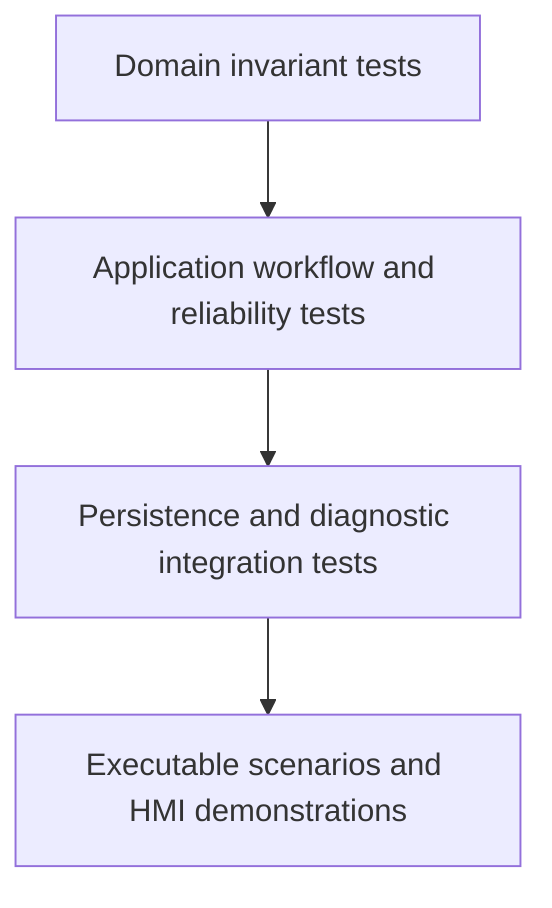

# Test Strategy

<!-- DOC-NAV:START -->
[Home](../README.md) · [Docs](README.md) · [Start](GETTING_STARTED.md) · [Implement](IMPLEMENTATION_GUIDE.md) · [Architecture](ARCHITECTURE.md) · [Test](TEST_STRATEGY.md) · [Interview](INTERVIEW_PREP.md)
<!-- DOC-NAV:END -->


## Test layers



## Domain tests

Implemented source covers:

- normal and prohibited state transitions;
- startup failure from `Off`;
- recipe validation;
- inclusive tolerance boundaries;
- out-of-range measurements;
- fault recovery targets.

## Application tests

Implemented source covers:

- normal inspection cycle;
- out-of-tolerance completed cycle;
- probe timeout and alarm persistence;
- probe-timeout recovery requiring homing;
- missing-part recovery preserving home;
- invalid recipe rejection without machine fault;
- operator stop and operation cancellation;
- overlapping-command rejection;
- primary probe fault preserved during secondary PLC output failure;
- diagnostic-log failure remaining a warning;
- asynchronous status observation during motion.

## Integration tests

Implemented source covers:

- SQLite schema initialization;
- transactional completed-cycle and measurement storage;
- JSONL output containing one valid JSON object per line.

## Executable scenarios

The console remains an acceptance harness:

```bash
dotnet run --project src/MotionControl.OperatorConsole -- normal
dotnet run --project src/MotionControl.OperatorConsole -- operator-stop
dotnet run --project src/MotionControl.OperatorConsole -- probe-timeout
dotnet run --project src/MotionControl.OperatorConsole -- part-missing
dotnet run --project src/MotionControl.OperatorConsole -- out-of-tolerance
```

## Windows HMI verification

The Windows workflow builds the WPF project. Manual behavior is tracked in:

```text
tests/manual/WPF_HMI_TEST_MATRIX.md
```

A future Windows-only test project should cover command availability, status updates, measurement presentation, and shutdown cancellation.

## Digital Twin manual verification

The Digital Twin profile is tracked separately because the current generation environment cannot execute Digital Twin:

```text
tests/manual/DIGITAL_TWIN_TEST_MATRIX.md
```

## Evidence labels

- **Implemented test source:** test code exists.
- **Automated verification pending:** must pass the .NET GitHub Actions workflow.
- **Manual simulation evidence:** executed in WPF or Digital Twin and recorded.
- **Physical validation required:** cannot be proven here.

## Release requirement

A release cannot claim verified behavior solely because test source exists. The corresponding CI or manual evidence must be attached to the release.

---

<!-- DOC-FOOTER:START -->
[← Previous: Failure Scenarios](FAILURE_SCENARIOS.md) · [Documentation index](README.md) · [Next: Development Plan →](DEVELOPMENT_PLAN.md) · [Back to top](#test-strategy)
<!-- DOC-FOOTER:END -->
